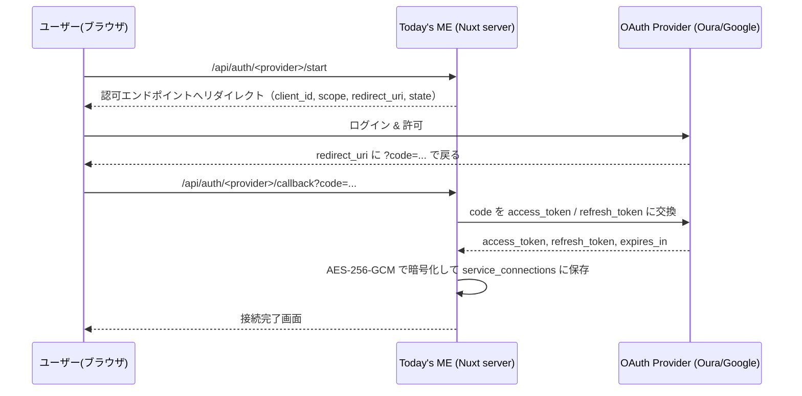
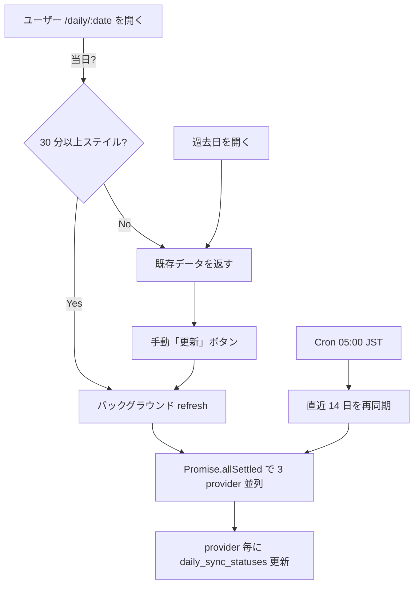
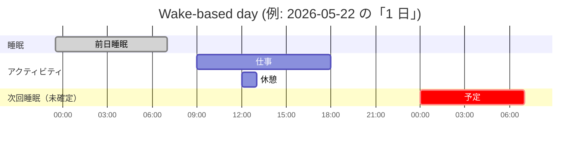

# LEARNINGS.md — Today's ME 学び直しノート

> 2026-05-22 時点のスナップショット。  
> 「自分が後で学び直すとき」に最短で要点を取り戻すための一枚物。  
> Web 初心者の語彙にも触れつつ、コード例ベースで「何のためにこれが必要だったか」を残す。

このプロジェクト（Today's ME）は Oura / Google Calendar / Toggl を 1 つの時間軸で可視化する個人向けダッシュボード。Nuxt 4 (SSR) + Supabase (Postgres + Auth) + Vercel という構成で、MVP は単一ユーザー前提。  
ここでは「コードを読めば分かること」ではなく、**「なぜそうしたか／何にハマったか」** を中心に書く。

---

## 目次

### 序章
- [0章. AI で加速しすぎるよりも「理解」が大事](#0章-ai-で加速しすぎるよりも理解が大事)

### インフラ
- [1章. Nuxt 4 と SSR](#1章-nuxt-4-と-ssr)
- [2章. Nuxt server routes と useFetch](#2章-nuxt-server-routes-と-usefetch)
- [3章. TypeScript strict と shared/schemas](#3章-typescript-strict-と-sharedschemas)
- [4章. pnpm と CI](#4章-pnpm-と-ci)
- [5章. 環境変数・シークレット管理](#5章-環境変数シークレット管理)
- [6章. Vercel デプロイと Preview](#6章-vercel-デプロイと-preview)
- [7章. Sentry とエラー監視・パフォーマンス計測](#7章-sentry-とエラー監視パフォーマンス計測)

### データ層
- [8章. Supabase と RLS](#8章-supabase-と-rls)
- [9章. Zod による境界バリデーション](#9章-zod-による境界バリデーション)
- [10章. デモテーブル分離と service_connections](#10章-デモテーブル分離と-service_connections)

### 外部連携
- [11章. OAuth2 と AES-256-GCM トークン暗号化](#11章-oauth2-と-aes-256-gcm-トークン暗号化)
- [12章. Toggl（個人 API token 方式）](#12章-toggl個人-api-token-方式)
- [13章. Cron・同期トリガー・部分失敗許容](#13章-cron同期トリガー部分失敗許容)

### ドメイン
- [14章. Wake-based Timeline と target_date](#14章-wake-based-timeline-と-target_date)
- [15章. ソフトデリートとデータライフサイクル](#15章-ソフトデリートとデータライフサイクル)

### パフォーマンス
- [16章. データフェッチ並列化と API パフォ改善](#16章-データフェッチ並列化と-api-パフォ改善)

### UI・運用
- [17章. SCSS additionalData と design-tone](#17章-scss-additionaldata-と-design-tone)
- [18章. Playwright MCP とテストファイルを書かない方針](#18章-playwright-mcp-とテストファイルを書かない方針)

### 終章
- [19章. AI 時代に何を学ぶか](#19章-ai-時代に何を学ぶか)

---

## 0章. AI で加速しすぎるよりも「理解」が大事

### 要点
- AI 補助は「速く書けた感」を強く出すが、客観計測ではむしろ遅くなる場面が報告されている（METR 2025 など）。
- AI 補助下のコードは「重複が増えやすい」「短期で書き直されやすい」傾向がある（GitClear 2024 など）。
- 生成物が外部の脆弱性経路（存在しない依存名を生成 → スクワット先で実装される「slopsquatting」など）を増やす副作用がある。
- 結論：**速さは目的ではなく副産物**。理解の地盤がないと、加速したぶん事故も加速する。

### 仕組み・設計理由（なぜこの章を最初に置くか）
このドキュメント全体の動機は「あとから自分が学び直せること」。  
コードを動かす AI は十分強力だが、**「なぜこの設計か」を保管しているのは自分しかいない**。  
だからこのノートは「動く理由」ではなく「**そう選んだ理由**」を書く。  
0 章はそのスタンスを最初に固定するためのもの。

### コード例
このプロジェクトの設計判断のうち、「AI に任せたら出てこなかった」「自分で決めて固定した」ものの代表：

```text
- 起床日基準の target_date（Oura は寝た日ではなく起きた日に紐付け）
- 同期は部分失敗を許容（1 サービス落ちても他を進める）
- service_connections のトークンを AES-256-GCM で暗号化、クライアントには絶対返さない
- テストファイルを「明示指示なしでは作らない」運用
- デモは demo_* テーブルに完全分離
```

これらは仕様書と Issue を読まないと AI には出せない判断で、ここを覚えておかないと「AI に直してもらう」ループに入った瞬間に崩れる。

### つまずきポイント
- 「動いたから OK」で進めると、半年後に自分で読んでも意図が辿れない。
- 「AI が書いたコード」と「自分が決めた設計」が混ざると、レビュー観点が曖昧になる。
- 「速さ」をメトリクスにすると、設計判断を AI に投げる癖がつく。**指標は「来週の自分が読めるか」**。

### Q&A
- **Q: AI を使わない方がいい？**  
  A: 違う。**判断を自分が握ったまま AI を呼ぶ**。設計・命名・境界（どこで検証するか）は自分で決め、実装の写経・調査・テンプレ化を AI に渡す、が現状の安全側。
- **Q: 何を残せば「理解」を保てる？**  
  A: 「なぜ A ではなく B にしたか」のメモ。コード自身では復元できない情報がそれだけ。本ファイルはそれを置く場所。

---

## 1章. Nuxt 4 と SSR

### 要点
- Nuxt 4 は `app/` 配下に `pages/` `components/` `layouts/` `assets/` を置く構成。
- SSR（Server-Side Rendering）はサーバ側で HTML を組み立ててから返す。初回表示が速く、認証必須ページを正しく扱える。
- 1 つのプロジェクトに **フロント（Vue）とサーバ（Nitro）** が同居する。

### 仕組み・設計理由
SSR にしている理由は 2 つ。

1. **認証チェックをサーバで完結したい**。クライアントだけで `auth.uid()` をチェックすると、ログイン状態が確定する前に一瞬「未ログイン UI」が出る。SSR ならサーバ側で Cookie を見て、最初の HTML から正しい状態で返せる。
2. **外部 API トークンを絶対にクライアントに渡さない**。Oura / Google のトークンはサーバの `server/api/*` の中だけで触る。SSR でも `useFetch` でサーバ経路を通せば、トークンはブラウザに漏れない。

**Web 初心者向け補足**：
- **CSR**（Client-Side Rendering, 旧来の React/Vue SPA）：最初に空 HTML → JS が動いてから描画。
- **SSR**：サーバが完成した HTML を返す。JS が動かなくても最初の表示が出る。
- **SPA**：ページ遷移時にフルリロードしない仕組み。SSR でも SPA でもありえる（Nuxt は両立）。

### コード例
ディレクトリ：

```
app/
  app.vue            ルート
  pages/             ファイルベースルーティング（/ , /demo, /daily/[date], /settings 等）
  components/        Vue コンポーネント
  layouts/           共通レイアウト
  assets/styles/     SCSS
server/
  api/               server routes（後述）
  utils/             サーバ専用ユーティリティ
shared/
  schemas/           Zod スキーマ（フロント・サーバ両方が import）
```

### つまずきポイント
- `app/` 配下と `server/` 配下では「動く環境」が違う。`app/` は **ブラウザでも動く**ので、ここに API キーを書くと **クライアントバンドルに漏れる**。サーバ専用処理は必ず `server/` 配下に置く。
- Nuxt 4 では `app/` プレフィックスが付くので、Nuxt 3 の例をコピペすると `pages/` の場所が違う。
- `compatibilityDate` を上げないと、依存ライブラリのデフォルト挙動が古いままになる。

### Q&A
- **Q: フロントとサーバを分けず 1 リポジトリにする利点は？**  
  A: 個人開発では「型を `shared/` で共通化できる」効果が大きい。リクエスト型を片方だけ直す事故が起きない。
- **Q: SSR は重くない？**  
  A: 1 ユーザー前提の MVP なら誤差。サーバ並列化（後述 16 章）の方が支配的。

---

## 2章. Nuxt server routes と useFetch

### 要点
- `server/api/foo.get.ts` を作ると `/api/foo` の GET エンドポイントになる（ファイル名 = ルート）。
- フロント側は `useFetch('/api/foo')` でそれを叩く。**型が自動で繋がる**のが大きな利点。
- ブラウザに渡したくない処理（外部 API 呼び出し、トークン復号、DB の `service_role` クエリ）は必ずここに置く。

### 仕組み・設計理由
ファイルベースのルーティング（Nitro が裏側）。**「URL を 1 個作る」＝「ファイルを 1 個置く」** に揃えることで、ルート定義の場所探しが要らなくなる。

`useFetch` はクライアント／サーバ両方から呼べて、SSR 時はサーバ内で直接関数呼び出しに近い形で解決される（HTTP を経由しない）。  
ここを `fetch('/api/foo')` で書くと、SSR 時にわざわざ自分自身に HTTP リクエストする無駄が出る。

### コード例

```ts
// server/api/summary.get.ts
export default defineEventHandler(async (event) => {
  const userId = await requireUserId(event);
  const date = getQuery(event).date as string;

  const [userRes, excludedRes, connections, syncRes] = await Promise.all([
    admin.from("users").select("timezone").eq("id", userId).maybeSingle(),
    admin.from("google_excluded_calendars").select("...").eq("user_id", userId),
    listServiceConnections(userId),
    admin.from("daily_sync_statuses").select("...")
      .eq("user_id", userId).eq("target_date", date),
  ]);
  // ...
});
```

```vue
<!-- app/pages/daily/[date].vue -->
<script setup lang="ts">
const route = useRoute();
const { data, error } = await useFetch("/api/summary", {
  query: { date: route.params.date },
});
</script>
```

### つまずきポイント
- `server/api/foo.ts`（拡張子のみ）は **全 HTTP メソッド受け付け**になる。GET だけにしたいなら `foo.get.ts`。
- `useFetch` は **同じ URL + query** に対しキャッシュを返すので、リロード相当の挙動が必要な場面では `refresh()` か `watch` を併用する。
- サーバ側で例外を投げると `useFetch` の `error` に流れる。**`createError` で `statusCode` / `statusMessage` を立てる**と、フロントで分岐できる。

### Q&A
- **Q: なぜ `/api/cron/daily` のような Cron もここに置く？**  
  A: Vercel Cron は HTTPS エンドポイントを叩く仕組み。Nitro 上の server route として書けば、Cron も「ただの POST エンドポイント」になる。

---

## 3章. TypeScript strict と shared/schemas

### 要点
- `tsconfig` は strict。`any` / 暗黙 `any` / null 漏れを早期に弾く。
- API リクエスト／レスポンスは **Zod スキーマで定義し、そこから `z.infer` で型を生む**。
- スキーマは `shared/schemas/` に集約し、フロント・サーバ・サーバ間ユーティリティから同じものを参照する。

### 仕組み・設計理由
「型を手書き」と「Zod でランタイム検証」を二重に持つと、片方だけメンテする事故が起きる。  
そこで **「Zod が真実、TS 型はその影」** にする：

```ts
export const summaryRequestSchema = z.object({ date: isoDateSchema });
export type SummaryRequest = z.infer<typeof summaryRequestSchema>;
```

これで「型を変えたのに検証が古い」「検証を直したのに型が古い」が物理的に起きなくなる。

ファイル分割は **サービス／用途別**：

```
shared/schemas/
  common.ts      isoDateSchema, serviceProviderSchema, syncStatusSchema など
  errors.ts      apiErrorItemSchema
  summary.ts     /api/summary 系
  oura.ts        Oura API レスポンス検証
  google.ts      Google API レスポンス検証
  toggl.ts       Toggl API レスポンス検証
  connections.ts service_connections 関連
  index.ts       barrel (export *)
```

利用側は `from "~~/shared/schemas"` だけ書く（barrel）。

### コード例

```ts
// shared/schemas/common.ts
export const serviceProviderSchema = z.enum(["oura", "google", "toggl"]);
export type ServiceProvider = z.infer<typeof serviceProviderSchema>;

// shared/schemas/summary.ts
import { serviceProviderSchema, isoDateSchema } from "./common";

export const summaryRequestSchema = z.object({ date: isoDateSchema });
export type SummaryRequest = z.infer<typeof summaryRequestSchema>;
```

### つまずきポイント
- **enum を重複定義しない**。`provider` / `source` / `status` のような DB 制約と対応する enum は `common.ts` に一度だけ。
- **default export 禁止**。barrel で `export *` できなくなる。常に named export。
- **`z.infer` した型名は PascalCase**（`summaryRequestSchema` → `SummaryRequest`）。命名がずれると追えなくなる。
- ログイン情報の型を自前定義しない（Google OAuth に任せる）。自分で書いた瞬間、OAuth プロバイダ仕様変更で壊れる。

### Q&A
- **Q: 型だけで十分では？**  
  A: 型は「コンパイル時」しか効かない。外部 API レスポンスは実行時に壊れた形で来ることがある。Zod は **境界（外部入力）で実行時検証**するためにいる。

---

## 4章. pnpm と CI

### 要点
- パッケージマネージャは pnpm（lockfile は `pnpm-lock.yaml`）。
- pre-commit で `lint-staged`（ESLint + Prettier）が走る。
- CI（GitHub Actions）で `pnpm lint` / `pnpm nuxi typecheck` / `pnpm build` が走る。落ちたら main にマージできない。

### 仕組み・設計理由
**ローカル（pre-commit）**と **リモート（CI）** で 2 段の網を張る理由：

- pre-commit は「自分の手元の typo / フォーマット崩れ」を 0 秒で潰す層。
- CI は「自分のマシン特有の状態に依存しない、純粋な再現確認」の層。Node バージョン違いで動かないコードはここで止まる。

pnpm を選んでいる理由：

- ディスク効率（コンテンツアドレッサブルストア）。
- `node_modules` の hoisting が緩く、宣言していない依存にうっかり依存する事故が少ない。

### コード例

```yaml
# .github/workflows/ci-check.yml の要点
- uses: actions/setup-node@v4
  with: { node-version: 22 }
- uses: pnpm/action-setup@v4
  with: { version: 10 }
- run: pnpm install --frozen-lockfile
- run: pnpm lint
- run: pnpm nuxi typecheck
- run: pnpm build
```

### つまずきポイント
- ローカルで動くのに CI で落ちるときの 9 割は **`pnpm-lock.yaml` をコミットし忘れ**。
- `pnpm sass` を忘れて UI を出すと、本番ビルドだけ古い CSS で出る。UI 実装後はテスト前に必ず実行する。
- `--frozen-lockfile` は CI で必須。これがないと lock がない依存を勝手に解決して、本番と微妙にバージョンが違うビルドができる。

### Q&A
- **Q: なぜ pre-commit で typecheck を走らせない？**  
  A: 重い。pre-commit は秒で終わる粒度、CI は分で終わる粒度、と層を分ける。

---

## 5章. 環境変数・シークレット管理

### 要点
- `.env.example` をテンプレに `.env` を作る。`.env` は **git 追跡外**。
- Supabase は **3 種類のキーを使い分ける**（公開 URL / publishable / secret）。
- 暗号化キー `TOKEN_ENCRYPTION_KEY` は **DB には絶対置かない**。鍵を DB に置いた瞬間、DB ダンプ流出 = 全トークン平文化。

### 仕組み・設計理由
公開してよいもの／サーバだけのもの／DB に置けないもの、を**役割で分離**する：

| 変数 | 役割 | 触ってよい場所 |
| --- | --- | --- |
| `NUXT_PUBLIC_SUPABASE_URL` | Supabase の URL | クライアント・サーバ |
| `NUXT_PUBLIC_SUPABASE_PUBLISHABLE_KEY` | 旧 anon key 相当（RLS 前提で公開可） | クライアント・サーバ |
| `SUPABASE_SECRET_KEY` | 旧 service_role 相当。**RLS をバイパスする** | サーバのみ（Cron 等） |
| `TOKEN_ENCRYPTION_KEY` | service_connections のトークン暗号化（base64 32B） | サーバのみ |
| `OURA_CLIENT_ID` / `OURA_CLIENT_SECRET` | Oura OAuth2 | サーバのみ |
| `GOOGLE_CLIENT_ID` / `GOOGLE_CLIENT_SECRET` | Google OAuth2 | サーバのみ |
| `TOGGL_API_TOKEN` | Toggl（個人 API token） | サーバのみ |
| `SENTRY_AUTH_TOKEN` | source map アップロード | ビルド時のみ |

`NUXT_PUBLIC_` プレフィックスのものだけ Nuxt がクライアントに渡す。これ以外は **書いた時点でサーバ専用**になる、と覚えておく。

### コード例

```ts
// 良い例：サーバ側 util から取る
const key = process.env.TOKEN_ENCRYPTION_KEY;

// 悪い例：app/ 配下（クライアントに含まれる）で参照
// → ビルドに鍵が入って漏れる
```

### つまずきポイント
- `SUPABASE_SECRET_KEY` を Edge / クライアントで使ってしまうと **全 RLS が無意味になる**。サーバ専用ユーティリティに閉じる。
- 鍵をローテーションするとき、`TOKEN_ENCRYPTION_KEY` だけ変えると **既存の暗号化済みトークンが復号不能**になる。鍵更新には再暗号化バッチが要る。
- `.env` を 1 ファイルでローカル・本番を兼ねようとすると事故る。本番値は Vercel の Environment Variables に置く。

### Q&A
- **Q: `publishable_key` を公開していい理由は？**  
  A: そのキーは RLS を **バイパスしない**。`auth.uid()` で行制限される側のキー。RLS を厳密に書いてある限り、公開しても他人のデータは読めない。
- **Q: `.env.example` には何を書く？**  
  A: キー名と「どこから取るか」のヒントだけ。値は書かない。

---

## 6章. Vercel デプロイと Preview

### 要点
- main にマージ → 本番デプロイ。
- feature ブランチを push → **Preview デプロイ**が自動生成。
- main への直接 push は禁止（保護ブランチ）。PR → Preview で確認 → マージの順を必ず通す。

### 仕組み・設計理由
- Preview は **PR ごとに固有 URL**が振られる。自分一人の MVP でも、これがあると「壊れているのは main か、この PR か」を切り分けられる。
- Cron は `vercel.json` に書く。`server/api/cron/daily` のような server route を時刻トリガーで叩く形になる。

### コード例

```jsonc
// vercel.json（概念）
{
  "crons": [
    { "path": "/api/cron/daily", "schedule": "0 20 * * *" }
    // 例：UTC 20:00 = JST 05:00
  ]
}
```

### つまずきポイント
- Cron スケジュールは **UTC** で書く。日本時間 05:00 にしたければ `0 20 * * *`。
- Preview と本番で **環境変数が違う**。Preview だけ Supabase の dev プロジェクトに繋げる、というセットアップを最初に決めないと、Preview で本番 DB を踏むことになる。
- `pnpm build` が CI で通っても、Vercel のビルドキャッシュが古いままだと Preview だけ壊れることがある。疑ったら一度キャッシュを無効化する。

### Q&A
- **Q: 個人開発でも保護ブランチを掛ける意味は？**  
  A: 「`git push --force main` 1 回」で消える前提を取れる。Preview で必ず目視確認するクセも付く。

---

## 7章. Sentry とエラー監視・パフォーマンス計測

### 要点
- エラーは **`@sentry/nuxt`** でクライアント・サーバ両方から送る。
- 例外を握り潰さない。**ユーザー操作の文脈ごとエラーが Sentry で再生できる**ことを最優先にする。
- パフォーマンスは tracing（`tracesSampleRate`）と replay で取る。MVP は `1.0`（全部送る）でよい。あとから絞る。

### 仕組み・設計理由
個人開発で「ログを見ない」「アラートを設定しない」と、**バグは「自分が遭遇して初めて気付く」状態になる**。  
Sentry を入れる目的は「気付くのを早くする」こと、これ一点。

`replayIntegration` を入れているのは、エラー発生時に **直前数十秒の DOM 変化と入力**まで遡って観察できるから。Wake-based Timeline のような独自概念の UI バグは、replay がないと再現できない。

### コード例

```ts
// sentry.client.config.ts（要点）
Sentry.init({
  dsn: import.meta.env.NUXT_PUBLIC_SENTRY_DSN,
  tracesSampleRate: 1.0,
  replaysOnErrorSampleRate: 1.0,
  sendDefaultPii: true,
  integrations: [
    Sentry.replayIntegration(),
    Sentry.consoleLoggingIntegration({ levels: ["error", "warn"] }),
  ],
});
```

```ts
// nuxt.config.ts（要点）
sentry: {
  org: "saki-llc",
  project: "todaysme",
  autoInjectServerSentry: "top-level-import",
},
```

### つまずきポイント
- `sendDefaultPii: true` は MVP（1 ユーザー＝自分）だから付けている。**ユーザーが増えたら必ず外す**。
- `tracesSampleRate: 1.0` はクオータを食う。トラフィックが増える前に下げる前提で置く。
- Sentry に外部 API トークンが乗らないように、エラー本文・ヘッダのスクラブ設定を確認する。**トークンを include する例外メッセージを投げない**のがそもそも防御線。

### Q&A
- **Q: パフォーマンスの「計測」と「改善」はどう分ける？**  
  A: 計測は Sentry tracing / Web Vitals の数字、改善は 16 章の並列化。**計測なしに改善しない**（速くなった気がする、で終わるから）。

---

## 8章. Supabase と RLS

### 要点
- DB は Supabase（Postgres）。
- **全 user 紐づきテーブルで RLS（Row Level Security）有効**。`auth.uid()` で行制限。
- `service_role` は **サーバ専用ユーティリティ**でしか使わない。

### 仕組み・設計理由
RLS は「**SQL レベルで権限を強制する**」仕組み。アプリ側の if 文を信用しないで済む。  
個人開発でも RLS を入れる理由：

- いつかマルチユーザー化するとき、**RLS なしから後付けすると壊滅的に難しい**。
- Supabase Studio から手で叩くときも、RLS が効いていれば事故が減る。

`service_role` キーは RLS をバイパスする。Cron や暗号化トークン操作のような **「自分の権限ではなくシステムとして動く処理」** にだけ使う。

### コード例

```sql
-- 概念図：service_connections テーブル
create table service_connections (
  id uuid primary key default gen_random_uuid(),
  user_id uuid not null references auth.users(id) on delete cascade,
  provider text not null check (provider in ('oura','google','toggl')),
  access_token_encrypted bytea,
  refresh_token_encrypted bytea,
  iv bytea,
  auth_tag bytea,
  expires_at timestamptz,
  status text not null default 'connected',
  ...
);

alter table service_connections enable row level security;

create policy "owner can read"
  on service_connections
  for select using (auth.uid() = user_id);
```

### つまずきポイント
- マイグレーションは GUI（Supabase Studio）で書いてもいいが、**必ず `supabase/migrations/` に SQL を残す**。残さないと、別環境で再現できない。
- `service_role` を 1 か所でも `app/` 配下にバンドルすると終わる。`process.env.SUPABASE_SECRET_KEY` を参照しているコードは **必ず `server/` 配下**にあること。
- RLS を「とりあえず全許可」で作ると、後で絞れない。最初から `auth.uid() = user_id` の形で書く。

### Q&A
- **Q: ローカル開発で RLS が邪魔なときは？**  
  A: ローカルだけ `supabase start` の admin で叩くか、サーバ utility 経由でテストする。**RLS を本番でだけ有効にする運用はやらない**（差が出ると本番でだけ落ちる）。

---

## 9章. Zod による境界バリデーション

### 要点
- 「**外から来るデータ**」は全部 Zod で検証してから使う。
- 検証は **`server/utils/validation.ts` の `parseOrThrow` / `parseExternal`** を経由する。`.parse()` を直接呼ばない。
- `parseExternal` は **失敗時に 502** を投げ、`statusMessage` にサービス名を載せる。

### 仕組み・設計理由
「境界」は 3 つある：

1. **クライアント → サーバ**（リクエスト body / query）
2. **サーバ → 外部 API → サーバ**（外部レスポンス）
3. **DB → アプリ**（型は出るが、null 許容や enum を Zod で再保証することがある）

それぞれ Zod を通すと、**型 = 実データ**が保証される。型はあくまでコンパイル時の幻なので、外部入力には実行時検証が必要。

`parseOrThrow` / `parseExternal` を経由する理由は **エラーの種類を一貫させる**ため。  
- リクエスト不正 → 400  
- 外部 API レスポンス不正 → 502（自分のバグじゃない、相手側）  
の切り分けが Sentry の集計でそのまま使える。

### コード例

```ts
// server/utils/validation.ts（要点）
export function parseExternal<S extends ZodType>(
  schema: S,
  data: unknown,
  service: "oura" | "google" | "toggl",
): z.infer<S> {
  return parseOrThrow(schema, data, {
    statusCode: 502,
    statusMessage: `InvalidExternalResponse:${service}`,
  });
}
```

```ts
// 使う側
const raw = await fetchOuraSleep(...);
const data = parseExternal(ouraSleepResponseSchema, raw, "oura");
```

### つまずきポイント
- 外部 API がたまにフィールドを足してくる → **`z.object` は余分なキーを許容する**ので壊れない。逆に `.strict()` を使うと外部 API の予告なし追加で死ぬ。
- enum を増やすとき、`shared/schemas/common.ts` の 1 箇所だけ直す。DB の CHECK 制約と Zod enum を両方直すのを忘れない。
- 「DB から取った値」を Zod に通すと、`null` が残っているケースで初めて気付くことがある。テーブル設計の null 許容と Zod の `nullable()` を揃える。

### Q&A
- **Q: パフォーマンス影響は？**  
  A: Zod のオーバーヘッドより、ネットワーク 1 往復の方が圧倒的に重い。検証を省く理由にはほぼならない。

---

## 10章. デモテーブル分離と service_connections

### 要点
- デモ表示は **`demo_oura_*` / `demo_google_*` / `demo_toggl_*`** という別テーブル群を使う。本番テーブルは触らない。
- 外部サービス接続は **`service_connections`** テーブルに集約。`(user_id, provider)` で 1 行。

### 仕組み・設計理由
**デモを本番テーブルに混ぜない理由**：

- フィルタ条件で分けると **必ず漏れる**（誰かが where を書き忘れる）。
- スキーマ進化が本番と歩調を合わせなくてよくなる（デモはサンプル固定で十分）。
- 「demo ユーザー」が RLS に紛れ込む事故を構造的に防げる。

**`service_connections` を 1 テーブルに統合する理由**：

- 各サービス用に別テーブル（`oura_connections` / `google_connections` / ...）にすると、トークン暗号化・更新・期限管理のロジックを 3 倍書くことになる。
- 認証フローは「provider が違うだけで構造は同じ（access_token, refresh_token, expires_at, status）」なので、共通化が効く。

### コード例

```sql
-- 主要列（概念）
create table service_connections (
  user_id uuid not null,
  provider text not null,        -- 'oura' | 'google' | 'toggl'
  access_token_encrypted bytea,
  refresh_token_encrypted bytea,
  iv bytea,
  auth_tag bytea,
  expires_at timestamptz,
  status text not null default 'connected',  -- 'connected' | 'reauth_required' | 'revoked'
  unique (user_id, provider)
);
```

### つまずきポイント
- Toggl は OAuth ではなく **個人 API token**（12 章）。`refresh_token_encrypted` / `expires_at` は null。**provider ごとに「埋まる列」が違う**ことを忘れない。
- デモテーブルは **マイグレーション対象**だが、毎回データを入れ直す運用ではない。固定サンプル前提。
- `status` の遷移は明示する。`reauth_required` になったら UI で再認証を促す導線を用意する（黙って 401 を投げ続けない）。

### Q&A
- **Q: provider 共通の `connection_id` を使うと何が嬉しい？**  
  A: 「どの接続から取り込まれたデータか」を子テーブル側に持てる。アカウント切り替え時に過去データを残しつつ、新規接続側のデータと混ざらない。

---

## 11章. OAuth2 と AES-256-GCM トークン暗号化

### 要点
- Oura / Google は **OAuth2 Authorization Code Grant**。
- トークンは **AES-256-GCM** で暗号化して保存。**クライアントに返さない / ログに出さない**。
- リフレッシュは `withFreshAccessToken` パターンで、401 を受けたら refresh → 再試行 1 回。

### 仕組み・設計理由

#### OAuth2 の流れ



ポイント：
- **トークン交換はサーバ側だけ**。`client_secret` がクライアントに渡らないように、`/api/auth/<provider>/callback` で受ける。
- **`state`** は CSRF 対策。発行時にセッションに紐付けて、戻ってきた `state` と一致しないと拒否。

#### AES-256-GCM

- 鍵長 32 バイト（256 ビット）の対称暗号。
- GCM は「暗号化 + 改ざん検出（auth tag）」を同時に行うモード。
- **IV（初期化ベクトル）は毎回ランダム、12 バイト**。同じ平文でも毎回違う暗号文になる。
- 鍵は `TOKEN_ENCRYPTION_KEY`（base64 32B）。**DB には絶対置かない**。

### コード例

```ts
// server/utils/crypto.ts（要点）
const ALGORITHM = "aes-256-gcm";
const KEY_LENGTH_BYTES = 32;
const IV_LENGTH_BYTES = 12;

export function encrypt(plain: string): EncryptedPayload {
  const key = loadKey();                     // base64 → 32 bytes
  const iv = randomBytes(IV_LENGTH_BYTES);
  const cipher = createCipheriv(ALGORITHM, key, iv);
  const ciphertext = Buffer.concat([cipher.update(plain, "utf8"), cipher.final()]);
  const authTag = cipher.getAuthTag();
  return { iv, authTag, ciphertext };
}

export function decrypt(payload: EncryptedPayload): string {
  const key = loadKey();
  const decipher = createDecipheriv(ALGORITHM, key, payload.iv);
  decipher.setAuthTag(payload.authTag);
  return Buffer.concat([
    decipher.update(payload.ciphertext),
    decipher.final(),
  ]).toString("utf8");
}
```

```ts
// 401 リトライ（概念）
export async function withFreshAccessToken<T>(
  conn: ServiceConnection,
  fn: (accessToken: string) => Promise<T>,
): Promise<T> {
  try {
    return await fn(decryptAccessToken(conn));
  } catch (e) {
    if (!is401(e)) throw e;
    const refreshed = await refreshAccessToken(conn);
    return await fn(refreshed);
  }
}
```

### つまずきポイント
- **IV を固定にしない**。固定 IV + GCM は鍵が事実上漏れるレベルで危険。毎回 `randomBytes(12)`。
- 認可 URL の `scope` を後から増やすと **再認証が必要**。ユーザー（自分）に「再接続して」を促す UI を用意する。
- `refresh_token` は **1 回しか出ない**プロバイダがある（Google の `access_type=offline` + `prompt=consent` で取り直すなど）。最初に取り損ねると後で詰む。
- ログに `access_token` を入れない。`Authorization: Bearer ...` を console.log するクセを最初に殺す。

### Q&A
- **Q: なぜ DB に鍵を置かない？**  
  A: DB ダンプが流出した瞬間に全トークンが復号可能になる。鍵と暗号文は **別の信頼境界に置く**のが原則。
- **Q: なぜ「対称暗号」？非対称じゃない？**  
  A: サーバ自身が同じ鍵で復号して使う用途なので、非対称にする利点がない。GCM の方が速くて短い。

---

## 12章. Toggl（個人 API token 方式）

### 要点
- Toggl Track は MVP では **個人 API token** で連携（OAuth ではない）。
- token は `service_connections.access_token_encrypted` に AES-256-GCM で保存。`refresh_token_encrypted` / `expires_at` は使わない。
- 認証ヘッダは `Authorization: Basic base64(<api_token>:api_token)`（Toggl 仕様）。

### 仕組み・設計理由
**なぜ Toggl だけ OAuth じゃないか**：

- Toggl の OAuth2 は商用クライアント向けで、個人開発の単一ユーザー MVP に対しオーバーキル。
- 個人 API token は **発行が 1 クリック**、有効期限なし、リフレッシュ不要。
- 「いずれ多人数対応するなら OAuth に切る」前提で、`service_connections` の **provider 列で分岐**するだけで済む構造にしてある。

### コード例

```ts
// 概念：Toggl リクエスト
const token = decryptAccessToken(conn);
const auth = Buffer.from(`${token}:api_token`).toString("base64");

const res = await $fetch(togglEndpoint, {
  headers: { Authorization: `Basic ${auth}` },
});
const data = parseExternal(togglTimeEntriesSchema, res, "toggl");
```

### つまずきポイント
- 「Basic 認証」と聞いて怯まない。Toggl の場合は token をユーザー名扱い、パスワード固定文字列 `api_token` に入れる、というだけの仕様。
- **OAuth に切り替えるときは provider ごとの認証ヘルパを分岐**できるよう、トークン取り出しを共通関数（`getAccessTokenFor(provider, conn)` 相当）で抽象化しておくと痛みが減る。
- 個人 token は **失効しないが、誤って公開すると即座に他人が叩ける**。`.env` から `git add` で漏らさないこと。

### Q&A
- **Q: 個人 token なのに暗号化する意味は？**  
  A: DB ダンプ流出時の被害を最小化するため。「漏れたら困るかどうか」で決めるのではなく「漏れた前提でどうか」で決める。

---

## 13章. Cron・同期トリガー・部分失敗許容

### 要点
- **同期トリガーは 2 系統**：
  - **当日**：ユーザーが画面を開いたとき、30 分以上ステイルならバックグラウンド更新。
  - **過去日**：手動「更新」ボタンのみ。
  - **Cron**：毎朝 05:00（JST）、直近 14 日を再同期。
- 同期は **部分失敗を許容**。3 サービスのうち 1 つが落ちても、他は進める。
- 同時実行は **`daily_sync_statuses`** で **conditional UPDATE** によりロック。10 分以上ステイルなロックは自動で奪取（stale lock recovery）。

### 仕組み・設計理由

#### 同期トリガーの全体像



#### 部分失敗許容

`Promise.all` だと **1 つ落ちると残りも捨てる**。同期は逆。Oura が落ちても Google / Toggl は通したい。→ `Promise.allSettled`。

#### Stale lock recovery

ロック行が `'running'` のまま 10 分以上動かなければ「落ちた」と見なして奪取。これがないと、Vercel の関数タイムアウトで落ちた瞬間にそのユーザーは永久に同期不能になる。

### コード例

```ts
// server/utils/runRefresh.ts（要点）
const settled = await Promise.allSettled(
  targets.map((provider) => refreshProvider(provider, ctx)),
);

for (const [i, r] of settled.entries()) {
  const provider = targets[i];
  if (r.status === "fulfilled") {
    await markSyncSucceeded(provider, ctx);
  } else {
    await markSyncFailed(provider, ctx, r.reason);
    // ※ throw しない。他 provider の成否を保持する
  }
}
```

```ts
// server/utils/syncLock.ts（要点）
const STALE_LOCK_MINUTES = 10;

// 条件付き UPDATE：未ロック or ステイルなら自分のものにする
const { data } = await admin
  .from("daily_sync_statuses")
  .update({ status: "running", started_at: now, runner: runnerId })
  .eq("user_id", userId)
  .eq("target_date", date)
  .eq("source", provider)
  .or(`status.neq.running,started_at.lt.${cutoff}`)
  .select("id")
  .maybeSingle();

if (!data) return { acquired: false };
```

### つまずきポイント
- `Promise.allSettled` の戻りは「成功か失敗か」をループで判定する必要がある。エラー扱いを忘れると、UI に「同期成功」が出るのに DB は失敗のまま、という捻れが起きる。
- Cron の対象期間を **30 日に伸ばしたくなる**が、Oura / Google の rate limit に当たる。14 日が現状の落としどころ。
- 「30 分ステイル」の判定は **サーバの時計**で行う。クライアントの時計を信用すると、時計ズレで永久に古いとも新しいとも判断不能になる。

### Q&A
- **Q: なぜ過去日は自動更新しない？**  
  A: 過去は基本変わらない。書き換わるのは「カレンダー上の予定を後から編集した」ようなレアケースだけ。**コストとレートリミットを温存**するため、明示操作だけにする。
- **Q: Cron が落ちたら？**  
  A: 翌朝に再実行されれば 14 日分カバーできる。**1 日落ちても自然回復**するように Cron の窓を広めに取ってある。

---

## 14章. Wake-based Timeline と target_date

### 要点
- 1 日は `00:00–24:00` ではなく **「前回起床 〜 現在 / 次回睡眠」**。
- Oura の睡眠データは **起床日**（ユーザータイムゾーンでの `wake_at` の日付）に紐付ける。**寝た日ではない**。
- タイムライン取得は `target_date` 完全一致ではなく、**wake range と `start_at`/`end_at` の重なり**で読む。

### 仕組み・設計理由
人間の体感「今日」は深夜 0 時で切れない。23:00 に始めた作業は「今日のこと」、3:00 に寝て 10:00 に起きたら「3:00 まで」は前日。  
これを素直にデータモデルに落とすため、**「起床」を 1 日の始点**にする。

#### イメージ



- `target_date = 2026-05-22` の wake range は **「2026-05-22 07:00 〜 (次の起床予測 or 現在時刻)」**。
- Toggl の time entry や Google のイベントは、`start_at`/`end_at` がこの range と重なれば「今日のタイムライン」に出す。

### コード例

```ts
// 概念：target_date 計算
function targetDateFor(wakeAt: Date, tz: string): string {
  return formatInTimeZone(wakeAt, tz, "yyyy-MM-dd");
}

// 概念：タイムライン取得
const wakeRange = await getWakeRange(userId, targetDate);
const events = await admin
  .from("google_calendar_events")
  .select("*")
  .eq("user_id", userId)
  .lt("start_at", wakeRange.end)
  .gt("end_at", wakeRange.start)
  .eq("is_deleted", false);
```

### つまずきポイント
- **タイムゾーン**を忘れない。`new Date().toISOString().slice(0, 10)` で `target_date` を出すと UTC で切られる。`users.timezone` を引いて変換する。
- 「寝た日」基準で書いたコードと「起床日」基準のコードが混ざる事故が起きやすい。**`target_date` の定義をコメントに書かない代わりに、関数名に意図を込める**（`targetDateFromWake`）。
- 範囲重なりの SQL は `start < range.end AND end > range.start`。**`<=` / `>=` のどちらが正しいか**を最初に決めて全箇所揃える（境界 1 秒のイベントの扱い）。

### Q&A
- **Q: 仮眠したら？**  
  A: 「セッション扱い」で本睡眠と分けるのが本来。MVP では最長セッションを wake 起点にしている。
- **Q: 起床予測が外れたら？**  
  A: 現在時刻まで、を上限にしている。実際に寝るまで「今日」が伸び続ける。

---

## 15章. ソフトデリートとデータライフサイクル

### 要点
- 削除は **`is_deleted = true`**（ソフトデリート）。
- 物理削除はバッチ／メンテナンスでのみ。普段のクエリは `is_deleted = false` で常にフィルタ。
- 外部 API から「消えた」イベントは、ローカル側で **ソフトデリートに落とす**。

### 仕組み・設計理由
**ソフトデリートの理由**：

- 外部 API のレスポンスは **一時的に欠落する**ことがある（rate limit / 一時障害）。物理削除すると、戻ってきたとき履歴が辿れない。
- 同期ロジックのバグで「全件消える → 翌日全件入り直す」事故を避けるため、**diff を比較できる状態**にしておく。
- UI 側で「消えたけど履歴では見たい」ニーズが出たとき、後付けできる。

### コード例

```sql
-- oura_sleep_records などすべての user データテーブルに
is_deleted boolean not null default false,
deleted_at timestamptz null,
```

```ts
// 通常クエリは必ず is_deleted = false
const { data } = await admin
  .from("oura_sleep_records")
  .select("*")
  .eq("user_id", userId)
  .eq("target_date", date)
  .eq("is_deleted", false);
```

### つまずきポイント
- `is_deleted = false` を **クエリのたびに書く**運用は漏れる。**ビューを切る**か **共通の問い合わせヘルパ**で吸収する設計の方が安全（MVP では明示でやっている）。
- ユニーク制約は **`(user_id, external_id, is_deleted)` ではなく `(user_id, external_id) where is_deleted = false`**（部分インデックス）にする。これを忘れると「同じ external_id を持つ削除済み行があるせいで新規 insert できない」事故が起きる。
- 物理削除バッチは、**自分が「これは要らない」と確信できる年単位の経過**を見てから書く。MVP では未実装で OK。

### Q&A
- **Q: GDPR 等で本当に消す必要があったら？**  
  A: そのときは物理削除パスを書く。MVP で前借りで実装しない。

---

## 16章. データフェッチ並列化と API パフォ改善

### 要点
- **DB 並列**：互いに独立な SELECT は `Promise.all` でまとめる。
- **外部 API 並列**：独立した provider 呼び出しは `Promise.allSettled` でまとめる（部分失敗許容）。
- **計測 → 最大要因を潰す**。当てずっぽうの最適化はしない。

### 仕組み・設計理由
SSR の遅さの大半は「**直列に待っている時間**」。  
例えば `/api/summary` で 4 つの SELECT を直列に並べると 4 × RTT。それを `Promise.all` で 1 RTT 相当に潰せる。  
ただし「並列にできない」ケースもある：

- 後段クエリが前段の結果に依存する（`user.timezone` を引いてから `target_date` を計算する等）→ 直列で OK。
- 同じテーブルに重い書き込みが走るとき → 並列に投げてもロック競合で遅くなる。

**外部 API は `Promise.all` ではなく `Promise.allSettled`**。理由は 13 章と同じ：1 つの失敗で他を捨てない。

### コード例

```ts
// /api/summary：4 クエリ並列
const [userRes, excludedRes, connections, syncRes] = await Promise.all([
  admin.from("users").select("timezone").eq("id", userId).maybeSingle(),
  admin.from("google_excluded_calendars").select("...").eq("user_id", userId),
  listServiceConnections(userId),
  admin.from("daily_sync_statuses").select("...")
    .eq("user_id", userId).eq("target_date", date),
]);
```

```ts
// refresh：3 provider 並列・部分失敗許容
const settled = await Promise.allSettled(
  targets.map((provider) => refreshProvider(provider, ctx)),
);
```

### つまずきポイント
- 並列化する前に **「何が一番遅いか」を測る**。N+1 SQL を放置したまま `Promise.all` を散らかしても効かない。
- `Promise.all` を闇雲に増やすと **コネクションプールを使い切る**。Supabase クライアントは内部でプール管理されるが、外部 API には rate limit がある。
- フロント側の `useFetch` は **同じ URL は重複排除される**ので、コンポーネントごとに同じ summary を取りに行っても 1 回しか飛ばない。これも実質的な並列化。

### Q&A
- **Q: Server Components みたいに並列が自動にならない？**  
  A: Nuxt は SSR でハンドラ内の `await` 順をそのまま実行するので、**書いた通りに直列／並列が決まる**。意識して並べる必要がある。
- **Q: Edge ランタイムに移したら速くなる？**  
  A: DB は Supabase（特定リージョン）なので、Edge に移しても DB までの RTT は減らない。先に DB クエリの並列化と N+1 潰しが優先。

---

## 17章. SCSS additionalData と design-tone

### 要点
- SCSS は `app/assets/styles/variables` と `mixins` が **`additionalData` で全 SCSS に自動 inject** される。各ファイルで `@use` する必要はない。
- UI の見た目は **`design-tone/` 配下のデザイン基準**をベースにする。独自にトーンを作らない。
- UI 実装後・テスト前に **`pnpm sass`** を必ず実行する。

### 仕組み・設計理由
**`additionalData` を使う理由**：

- 変数・mixin の `@use` を全ファイルに書くと、ファイル先頭が定型コードで埋まる。
- 「import 忘れて変数が undefined」というよくあるミスを構造的に消せる。

**`design-tone/` を基準にする理由**：

- AI に「いい感じに」UI を書かせると、トーンが毎回バラつく。**1 か所に正解の見本**を置いて、そこを参照する形にしないと整合が取れない。

### コード例

```ts
// nuxt.config.ts（要点）
vite: {
  css: {
    preprocessorOptions: {
      scss: {
        additionalData: `
        @use "sass:color";
        @use "~/assets/styles/variables" as *;
        @use "~/assets/styles/mixins" as *;
        `,
      },
    },
  },
},
```

```scss
// app/assets/styles/design-tokens.scss など
$color-bg-base: ...;
$color-text-primary: ...;
$radius-card: ...;
$shadow-card: ...;
```

### つまずきポイント
- **`additionalData` は「全 SCSS の先頭に貼られる」**だけ。重い処理を入れるとビルドが遅くなる。変数定義と mixin だけにする。
- `design-tone/` を見ずに「いい感じ」で書くと、別ページとの整合が崩れる。**新しい色や spacing を増やす前に必ず `design-tone/` を見る**。
- `pnpm sass` を忘れた状態の Preview に騙されない。Preview だけ古い CSS が残っているのか、本当に直っていないのかの判定がしにくくなる。

### Q&A
- **Q: Tailwind に切り替えない？**  
  A: 1 ユーザー前提の MVP では、トーンを 1 つ守るだけで十分。Tailwind の学習コストよりも、`design-tone/` を覚える方が早い。

---

## 18章. Playwright MCP とテストファイルを書かない方針

### 要点
- UI の動作確認は **Playwright MCP（ブラウザ操作）で都度行う**。
- **テストファイル（`*.test.ts` / `*.spec.ts`）は明示指示なしで作らない**。Playwright のテストファイル（`tests/` 配下）も同様。
- Playwright が実行できない場合（ローカル Supabase 未起動など）は、**勝手に省略せずユーザーに確認**する。

### 仕組み・設計理由
**「テストファイルを書かない」のは、テストしない、ではない**。

- 開発初期のテストは **「仕様の解釈ミス」を固定化**するリスクがある。間違った仕様で書いたテストが緑になり、それを「動く証拠」と勘違いするのが一番怖い。
- Playwright MCP は **書き起こさず即時に確認**するスタイル。UI を見て触って動くなら次へ。
- 仕様が落ち着いたところから順に、明示指示の上でテストを足す（「テスト書いて」とユーザーが言ったときだけ）。

### コード例

```text
UI 実装フロー（このプロジェクト）：

1. 実装
2. pnpm sass
3. pnpm dev で http://localhost:3000 起動
4. Playwright MCP で対象画面を開き、golden path と edge case を触る
5. 必要なら console / network を確認
6. 問題なければ PR、Vercel Preview でも再確認
```

### つまずきポイント
- 「型が通る = 動く」ではない。**UI の動作確認だけは目視（または Playwright MCP）でしかカバーできない**。
- ローカルの Supabase が止まっていると、API が 500 を返してフロント側だけ見ても何が悪いかわからない。**`supabase start` を最初に確認**。
- 「テストがないのは不安」と思ったら、**それは仕様が固まっていないサインの方が多い**。仕様が固まっていない段階でテストを書くと、後で全部捨てる。

### Q&A
- **Q: いつテストを書くか？**  
  A: ユーザー（自分）が増えた／回帰の痛みが出始めた／コード変更で同じバグが 2 回出た、のいずれか。

---

## 19章. AI 時代に何を学ぶか

### 要点
AI が「書く」ことを担う時代に、自分が握り続けるべき判断は 4 つに収斂する：

1. **DB**（データモデル・RLS・マイグレーション）
2. **セキュリティ**（境界・鍵管理・最小権限）
3. **ドメインモデル**（Wake-based のような、業界知識でしか決まらない構造）
4. **仕様判断**（やらないことを決める力）

### 仕組み・設計理由
それぞれ「**AI に投げると最も事故りやすい**」領域。

#### 1) DB
- データモデルは **取り消しが効かない**。マイグレーションは積み上がり、誤った設計を後で剥がす作業はアプリより重い。
- 学ぶ核：**正規化と非正規化の判断**／**RLS（行レベル権限）**／**インデックスの当て方**／**マイグレーション運用（破壊的変更の手順）**／**トランザクション境界**／**ソフトデリートと部分インデックス**。
- 言語より長持ちする知識。SQL と関係モデルが分かれば、フレームワークが変わっても通用する。

#### 2) セキュリティ
- 「どこからどこまでが信頼境界か」を決められるのは設計者だけ。AI は与えられたコードの局所最適しか見えない。
- 学ぶ核：**OAuth2 の流れ**／**対称暗号と AEAD（GCM の auth tag）**／**シークレット管理（鍵を DB に置かない、ログに出さない）**／**RLS / 最小権限**／**入力検証の境界**。
- 「漏れたら困るか」ではなく「**漏れた前提でどう守るか**」で考える。

#### 3) ドメインモデル
- Wake-based Timeline / target_date のような **業界・身体・運用の知識から導かれる構造**は、AI には決められない。要件を聞いて作るしかない。
- 学ぶ核：**「ユーザーが本当はどう数えているか」を観察する力**／**境界条件の言語化（深夜またぎ、タイムゾーン、仮眠）**／**「やらないこと」をモデル化する勇気**（仕様に書かない選択も設計）。

#### 4) 仕様判断
- 「やらない」「今は要らない」を決める力。AI はだいたい「やる」方向に倒れる。
- 学ぶ核：**MVP の線引き**／**部分失敗をどこまで許容するか**／**過去日の自動更新をやらない、のような運用判断**／**テストを今書くべきかどうか**。

### コード例
本プロジェクトの「**AI には決められなかった**」判断の集合：

```text
- Oura は寝た日でなく起床日に紐づける（業界知識）
- 過去日は手動更新だけにする（運用判断）
- Cron は直近 14 日だけ（コスト・rate limit）
- 同期は部分失敗を許容（UX 判断）
- Toggl は MVP では個人 API token（コスト判断）
- テストファイルは明示指示まで作らない（学習コスト判断）
- デモは demo_* に分離（事故予防）
- service_role はサーバ utility のみ（信頼境界）
- AES-256-GCM の IV は毎回ランダム（暗号の正しい使い方）
- RLS は最初から auth.uid() = user_id で書く（将来対応）
```

これが「自分が握り続けたもの」のリスト。来週の自分はここから読めば、AI に投げ直す前にやることが分かる。

### つまずきポイント
- 「AI が出したから正しい」と思った瞬間、自分の判断ログが消える。**自分が決めた線は明示的に残す**（このノートがその役割）。
- 「全部理解してから書く」も罠。**書きながら、書いた直後に「なぜそうしたか」を残す**のがちょうどよい速度。
- 「教科書から順番に」も罠。**自分のプロジェクトで詰まったところから掘る**方が定着する。Today's ME で詰まったところ＝ここに書いてあるところ、で良い。

### Q&A
- **Q: 4 つのうち、最初に深掘りすべきは？**  
  A: **DB**。やり直しのコストが一番高い。
- **Q: AI を使い続ける前提で、自分の役割は？**  
  A: 「**境界を引く人**」。どこで検証するか／どこに鍵を置くか／どこに信頼を置くか。境界が引けていれば、AI に書かせても事故が局所化される。
- **Q: このノートをこれからどう更新する？**  
  A: 「**自分が後で読んで詰まったところ**」を見つけたら、その章の「つまずきポイント」と「Q&A」に追記する。新章を増やすより、既存章を厚くする方が再学習に効く。

---

_End of LEARNINGS.md_
