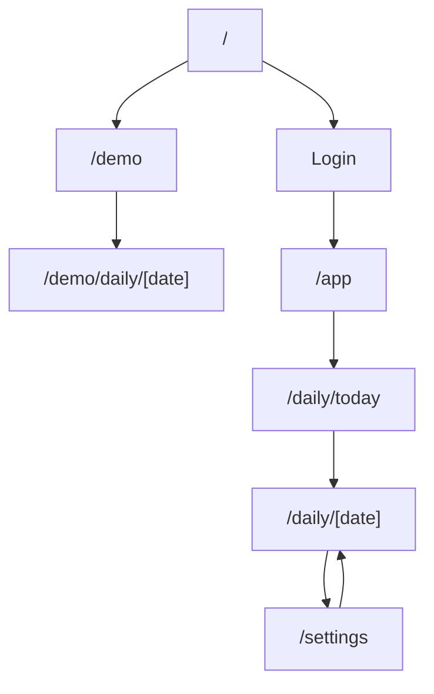
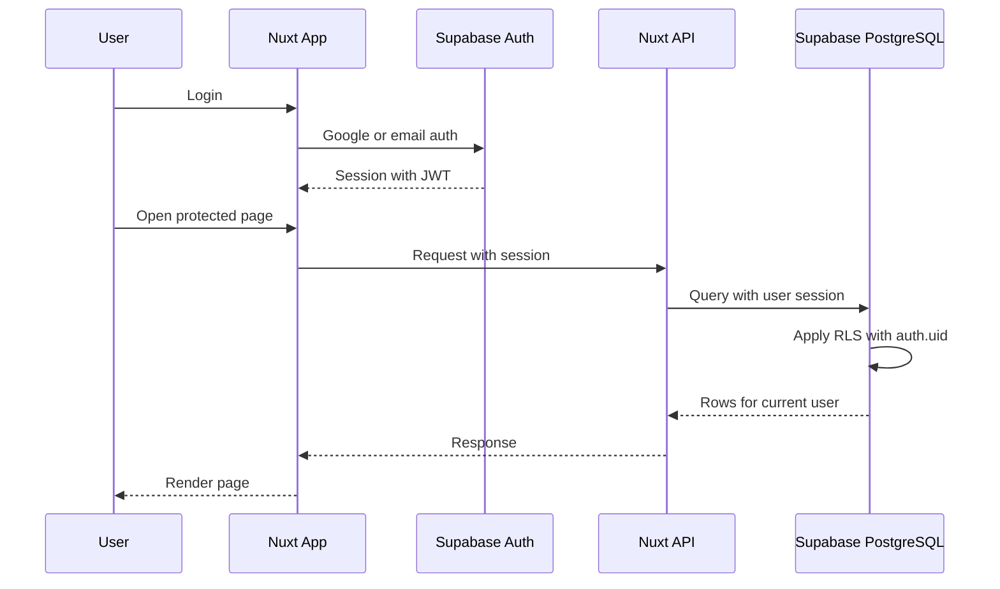
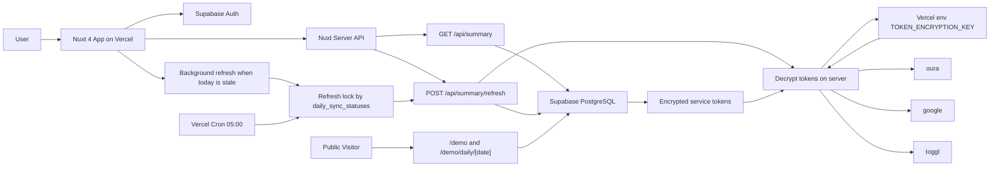
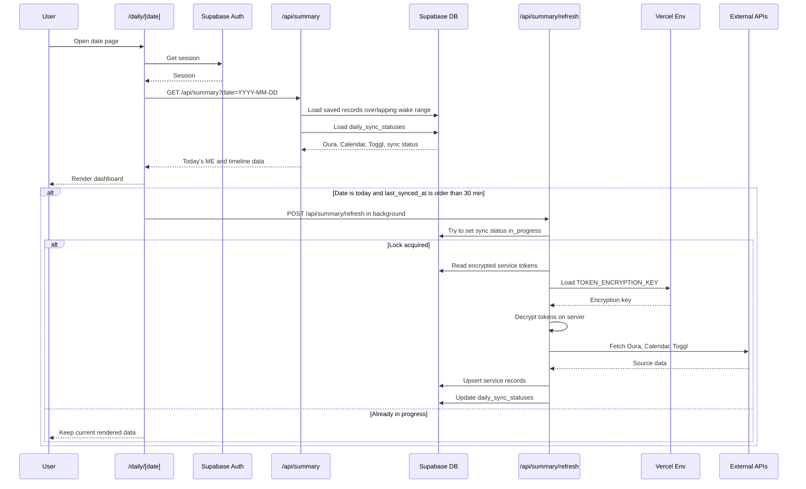
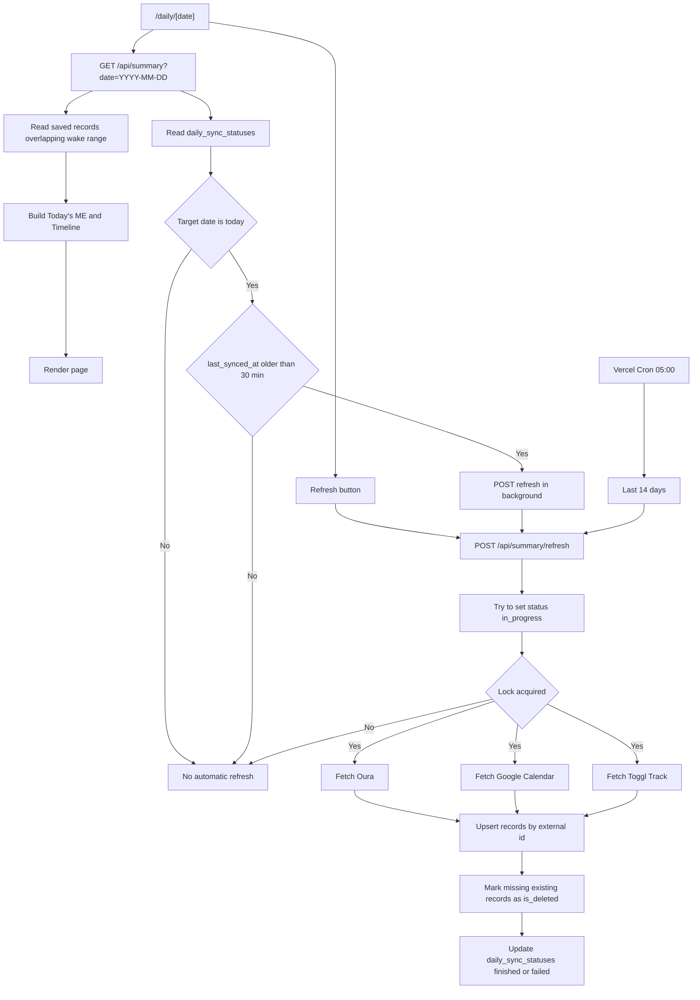
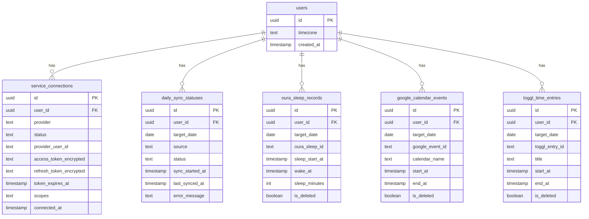
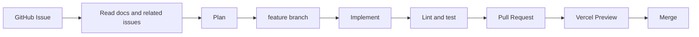

# Today's ME 仕様書

> このドキュメントは `spec-rough.md` と Issue #1〜#28（特に #12, #24, #25）を統合した確定版の仕様。
> 出典の優先順位は **コードベース > このドキュメント > spec-rough.md > Issue**。
> 矛盾が出た場合はコードを正、次にこの SPEC.md を正とする。

---

## 1. 概要

Today's ME は、Oura / Google Calendar / Toggl Track を統合し、「今日をどう使ったか」を 1 つの時間軸で可視化する個人向けダッシュボード。

- 今日やること
- 今日やったこと
- 今日の身体状態

をひとつの画面に並べる。

### 目的

- フルスタックアプリ開発経験 / モダン Web 構成の実践
- 外部 API 統合 / 認証 / DB / API / 可視化 / デプロイ経験
- ポートフォリオ公開
- 自分用の実運用

### 初期 MVP は単一ユーザー（開発者本人）運用前提

マルチユーザー対応は将来課題。Cron 等も MVP では自分 1 ユーザー固定で動かす。

---

## 2. コンセプト

### Today's ME

その日の状態を一目で把握するためのサマリーダッシュボード。

### Wake-based Timeline

1 日を `00:00–24:00` ではなく **「前回起床〜次回睡眠（または現在）」** として扱う。

- **当日** … 前回起床時刻 〜 現在時刻
- **過去日** … 前回起床時刻 〜 次回睡眠開始時刻

### target_date の定義（重要 / Issue #24）

Oura の睡眠データは **睡眠開始日ではなく、起床した日** に紐づける。
各レコードの `target_date` は **ユーザータイムゾーンにおける `wake_at` の日付** とする。

例:

```
睡眠開始: 2026-05-15 23:30
起床:     2026-05-16 07:00
→ target_date = 2026-05-16
```

タイムゾーンはユーザー設定（`users.timezone`）に従う。

---

## 3. 使用サービス（外部 API）

| サービス | 取得対象 | API 仕様（Issue #11） |
| --- | --- | --- |
| **Oura** | 睡眠 / readiness / 活動量 / 起床時刻 / active calories | Oura API v2 (`https://api.ouraring.com/v2`)。OAuth2 / Bearer。`daily_sleep`・`daily_readiness`・`daily_activity`・`sleep` 等。Rate limit 5000 req / 5 min。 |
| **Google Calendar** | 今日の予定 / カレンダー別予定時間 / 会議時間 | Calendar API v3。OAuth2、最小スコープ `calendar.events.readonly`。`events.list` + `nextSyncToken` で差分同期。 |
| **Toggl Track** | 今日の作業時間 / タイトル別作業時間 | Track API v9。API token を Basic Auth で利用（`api_token` を password に指定）。`GET /me/time_entries` を `since` watermark で差分取得。 |

### 分類ルール

- **Google Calendar**: カレンダー単位で分類（例: パーソナル / MTG / 勉強・思考 / 学習 / 予定ブロック）。
  - **会議時間（`meeting_minutes`）**: 「MTG」とみなすカレンダーに属するイベントの合計時間。
  - **どのカレンダーを「MTG」とみなすかは要確認**（現状は `calendar_name === "MTG"` の前提でデモデータを作成しているが、本番カレンダー名は未確定。実装着手前に対象カレンダー ID／名称をユーザー設定 or 定数として明示する）。
- **Toggl Track**: タイトル単位で扱う。ただし **別プロジェクト / 別 ID は別データ** として扱う。

---

## 4. 中核 UI

### 4.1 Today's ME（日次サマリー）

#### Oura
- 睡眠時間
- 睡眠スコア
- readiness
- 起床時刻
- active calories

#### Google Calendar
- 今日の予定時間
- カレンダー別予定時間
- 会議時間

#### Toggl Track
- 今日の作業時間
- タイトル別作業時間

#### 独自集計
- 起床から現在までの経過時間
- アクティブ時間割合
- 未記録時間

### 4.2 Wake-based Timeline

Oura / Google Calendar / Toggl Track を統合した 1 本のタイムライン。

| レーン | データソース |
| --- | --- |
| Sleep | Oura 睡眠 |
| Calendar | Google Calendar 予定 |
| Work | Toggl Track 作業ログ |

タイムラインに載せるレコードは **wake range と `start_at`/`end_at` の重なり** で判定する（`target_date` 完全一致では取りこぼすため）。

---

## 5. ページ構成

### 公開ページ（ログイン不要）

| ルート | 内容 |
| --- | --- |
| `/` | トップページ |
| `/demo` | 公開デモのエントリ |
| `/demo/daily/[date]` | デモ用日次詳細ページ（デモ専用テーブルから読む） |

### 認証必須ページ

| ルート | 内容 |
| --- | --- |
| `/app` | `/daily/today` にリダイレクト |
| `/daily/[date]` | 日次詳細（Today's ME + Wake-based Timeline + 各サービス詳細）。`date` は `YYYY-MM-DD` または `today` |
| `/settings` | 外部サービス連携設定（Oura / Google / Toggl の接続・切断、タイムゾーン設定） |

### ページ遷移図



---

## 6. 認証

### 方式: Supabase Auth

- **Google ログイン**
- **メールアドレスログイン**

JWT は Supabase Auth から発行され、Supabase PostgreSQL の **RLS で `auth.uid()` を使って行レベルで制御** する。Supabase の操作は基本的に GUI から行い、SQL 変更は `supabase/migrations/` に SQL ファイルとしてコミットする（Issue #26）。



---

## 7. アーキテクチャ

### 7.1 全体図



### 7.2 インフラ

| レイヤ | サービス |
| --- | --- |
| Frontend / API | Nuxt 4 + Vercel |
| Database / Auth | Supabase（PostgreSQL + Supabase Auth） |
| Cron | Vercel Cron（毎朝 05:00 に `POST /api/summary/refresh` 系を起動） |
| エラートラッキング | Sentry（client / server 両方初期化済み） |

### 7.3 Cloudflare

- Proxy は利用しない。
- 必要に応じて **DNS 管理のみ** 利用する。

---

## 8. 使用技術

| カテゴリ | 採用 |
| --- | --- |
| フレームワーク | Nuxt 4（SSR）、Vue 3 |
| 言語 | TypeScript（strict） |
| 状態管理 | Pinia |
| サーバ API | Nuxt server routes |
| スキーマ検証 | Zod（内外問わず API レスポンスを検証 / Issue #20） |
| スタイル | SCSS（sass-embedded）、Stylelint、Prettier |
| Lint | ESLint（**今後導入**。Issue #27 で初期から入れる方針）、Stylelint、Prettier |
| テスト | Playwright |
| エラートラッキング | Sentry（`@sentry/nuxt`） |
| ランタイム | Node 22（`.nvmrc` で固定 / Issue #14） |
| パッケージマネージャ | pnpm 11（corepack で固定） |
| ビルド | Vite 8 |

### CI（Issue #22 / 未実装）

`.github/workflows/ci.yml` を追加し、`push` 時に以下を実行する前提:

- `pnpm install --frozen-lockfile`
- `pnpm lint`
- `pnpm typecheck`（`nuxi typecheck`）
- `pnpm build`

ローカルでは Husky + lint-staged により pre-commit で staged ファイルに `eslint --fix` / `prettier --write` を走らせる。

---

## 9. API 構成

### 9.1 公開エンドポイント

| エンドポイント | 役割 |
| --- | --- |
| `GET /api/summary?date=YYYY-MM-DD` | 対象日の Today's ME と Wake-based Timeline 用統合データを返す。**DB に保存された各サービスのレコードから読込時に組み立てる**（事前計算しない）。 |
| `POST /api/summary/refresh` | 対象日のデータを再取得・再同期する。Oura / Google / Toggl を叩いて DB に upsert する。 |
| `GET /api/cron/daily` （仮 / MVP） | Vercel Cron 専用。直近 14 日 × （MVP では自分 1 ユーザー）の refresh を実行。 |

> **注**: Oura / Google / Toggl の個別 API クライアントは `server/utils/` 等の **内部モジュール** として実装する。`/api/oura`・`/api/google`・`/api/toggl` のような **サービス別 HTTP エンドポイントは公開しない**（spec-rough.md にはあったが、内部化することで責務とテスト容易性を優先）。

### 9.2 API 失敗時のレスポンス形式

部分失敗を許容し、失敗したサービス名とエラー内容を返す。

```json
{
  "errors": [
    { "service": "google", "message": "token expired" }
  ]
}
```

成功した部分はレスポンスに含める。Refresh は **サービス単位で sync status を更新** し、全部失敗でなければ部分成功として扱う。

### 9.3 `/daily/[date]` のシーケンス



---

## 10. データ取得・同期方針

### 10.1 基本方針

外部 API を毎回直接参照せず、取得済みデータを DB に保存する。表示時は DB のみを読む。

### 10.2 同期トリガー

| トリガー | 対象 | 備考 |
| --- | --- | --- |
| **手動更新ボタン** | 表示中の日 | `/daily/[date]` の更新ボタン押下で `POST /api/summary/refresh` |
| **バックグラウンド自動更新** | 当日 | `/daily/today` 表示時に `daily_sync_statuses.last_synced_at` が **30 分以上古ければ** 裏で `POST /api/summary/refresh` を呼ぶ |
| **Vercel Cron** | 直近 14 日 | 毎朝 05:00。15 日以前は対象外 |

### 10.3 15 日以前のデータ

自動同期しない。対象日のページを開き、手動更新ボタンを押した時のみ再取得する。

### 10.4 同期データフロー



---

## 11. DB 設計

### 11.1 ER 図



### 11.2 各テーブルの制約・運用

#### users
- Supabase Auth が管理する `auth.users` と 1:1 で対応する。
- `timezone` はユーザー設定（タイムゾーンは **ユーザー設定** とする）。

#### service_connections
- 外部サービス連携のトークンとメタ情報を保持。
- `access_token` / `refresh_token` は **AES-256-GCM** で暗号化して保存。
- `TOKEN_ENCRYPTION_KEY` は base64 encoded 32 bytes として **Vercel env に保存**。DB には置かない。
- DB には `iv` / `authTag` / `ciphertext` を保存。
- 連携時: provider token を受け取る → Nuxt server で暗号化 → DB へ保存。
- リフレッシュ時: DB から暗号化トークンを読む → Nuxt server で復号 → 外部 API を呼ぶ。
- トークンは **ブラウザに返さない / ログに出さない**。
- `access_token` が期限切れなら `refresh_token` でサーバ側から更新する。

#### daily_sync_statuses
- `unique(user_id, target_date, source)`
- `status`: `idle` / `in_progress` / `success` / `failed`
- 多重実行対策は **上記 unique キーの行を条件付き更新して `in_progress`** にする（タイムスタンプ unique では取り扱わない）。
- `sync_started_at` が古すぎる `in_progress` は timeout 扱いにできる。

#### oura_sleep_records
- `unique(user_id, oura_sleep_id)`
- 初期仕様では **睡眠時間にフォーカス**。readiness / 活動量は別レコード（または daily_* 系を将来追加）。
- Issue #24 のとおり `target_date` は wake date（ユーザータイムゾーンで起床した日）。

#### google_calendar_events
- `unique(user_id, google_event_id)`
- 表示時は **`target_date` 完全一致ではなく、wake range と `start_at`/`end_at` の重なり** で読む。

#### toggl_time_entries
- `unique(user_id, toggl_entry_id)`
- 表示時は wake range と `start_at`/`end_at` の重なりで読む。

### 11.3 削除対応（物理削除しない）

同期時に取得できなかった既存データは `is_deleted = true` でソフトデリート。

### 11.4 デモデータ

デモ用のデータは **デモ専用テーブル**（`demo_oura_sleep_records` / `demo_google_calendar_events` / `demo_toggl_time_entries` 等）として **本番テーブルと分離** する。
公開デモは **ログイン不要・外部 API 不要** で、これらのテーブルから読む。

### 11.5 マイグレーション運用（Issue #26）

Supabase は基本的に GUI で操作し、変更後の SQL は `supabase/migrations/` 配下にコミットする。

---

## 12. セキュリティ

### 12.1 サービストークン暗号化

- 方式: **AES-256-GCM**
- 実装: Nuxt server API 上で Node.js 標準 `crypto` を使用。
- 鍵: `TOKEN_ENCRYPTION_KEY`（base64 encoded 32 bytes）を Vercel env に保存。DB には置かない。
- DB 保存項目: `iv` / `authTag` / `ciphertext`。
- トークンは **クライアントに送らない / ログに出さない**。

### 12.2 RLS

- すべての user 紐づきテーブルで RLS を有効化し、`auth.uid()` で行を制限。
- デモ専用テーブルは公開 read 可能な RLS を設定。

### 12.3 入力 / 出力検証

- API のリクエスト / レスポンスは **Zod でスキーマ検証**（Issue #20）。

---

## 13. AI 開発フロー



- `main` への直接 push は不可（保護ブランチ / Issue #23）。
- PR は Vercel Preview で動作確認後にマージ。

---

## 14. 初期 MVP

### 実装対象

- `/demo` / `/demo/daily/[date]`
- `/daily/[date]` / `/daily/today`
- Today's ME
- Wake-based Timeline
- Oura 連携 / Google Calendar 連携 / Toggl Track 連携
- サービストークン暗号化保存（AES-256-GCM）
- DB 保存 / ソフトデリート
- 手動同期（更新ボタン）
- バックグラウンド自動更新（30 分ステイルで裏 refresh）
- 毎朝 5 時の自動同期（直近 14 日 / **自分 1 ユーザー固定**）
- `/settings`（サービス連携・タイムゾーン）

### 初期は実装しないもの

- AI チャット
- SNS 機能 / チーム共有 / 通知
- 自動分析 / 週間・月間分析
- モバイルアプリ
- リアルタイム同期
- SaaS 公開
- マルチユーザー対応の Cron スケール
