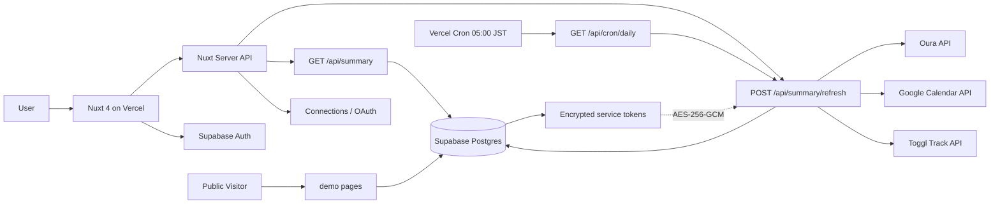

# Today's ME Onboarding

新しくこのプロジェクトに入った人が「**最初の 30 分で全体像を掴む**」ためのオンボーディングドキュメント。コードベースをディレクトリ単位ではなく **責務単位** で分解して説明する。

> **このドキュメントの読み方**: ここに書いてあるのは「**なぜそうなっているか**」。
> 「何があるか」「どう書くか」はコード自身と `docs/SPEC.md` を正とする。
> 矛盾を見つけたら、コード > `docs/SPEC.md` > このドキュメント、の順で正と扱う。

---

## 1. このアプリが解決すること

Today's ME は、**Oura（睡眠 / readiness）/ Google Calendar（予定）/ Toggl Track（作業ログ）** を 1 つの時間軸に統合する個人向けダッシュボード。

普通の「1 日」は `00:00–24:00` で区切られるが、人間の体感としての「今日」は **起床から次に寝るまで**。このアプリは「**Wake-based Timeline**」という考え方で、Oura の起床時刻を 0 時間目として 1 日を組み立てる。

ユースケースは大きく 2 つ:

- **`/daily/today` を開いて、今朝起きてからの自分の使い方をひと目で見る**
- **`/daily/[date]` で過去日を振り返る**

MVP は単一ユーザー運用（開発者自身）が前提。マルチユーザー対応の cron スケールや AI チャットなどは初期スコープ外。

---

## 2. 技術スタック（30 秒版）

| レイヤ | 採用 | 役割 |
| --- | --- | --- |
| フロント / API | **Nuxt 4 (SSR)** + Vue 3 | 画面とサーバ API を同居 |
| 言語 | **TypeScript strict** | 型安全 |
| 状態管理 | （Pinia は将来用に SPEC に記載。**現状ストアなし**）| `useState` / SDK 内部状態で足りている |
| 認証 | **Supabase Auth**（Google OAuth / Email） | JWT を発行 |
| DB | **Supabase PostgreSQL** + RLS | `auth.uid()` で行レベル制御 |
| スキーマ検証 | **Zod**（`shared/schemas/`） | API I/O と外部 API レスポンスを検証 |
| 暗号化 | Node 標準 `crypto`（AES-256-GCM） | 外部サービストークン保存用 |
| Cron | **Vercel Cron**（毎朝 05:00 JST） | 直近 14 日を再同期 |
| ホスティング | **Vercel** | Preview / Production |
| エラートラッキング | **Sentry**（client / server 両方） | |
| パッケージマネージャ | **pnpm 11**（corepack） | Node 22（`.nvmrc`） |

---

## 3. システム全体像



責務の縦割り:

- **画面（`app/`）** → SSR / SPA としてユーザーに描画する責務だけを持つ。外部 API は直接触らない。
- **サーバ API（`server/api/`）** → 認証・認可・Zod 検証・DB 操作 / 外部 API 呼び出しを編成する。
- **同期ユーティリティ（`server/utils/`）** → 外部 API クライアント・暗号化・OAuth・同期ロック等の低レベル責務。
- **共有スキーマ（`shared/schemas/`）** → 画面とサーバの両方が import する Zod スキーマ + 推論型。
- **DB（`supabase/migrations/`）** → スキーマと RLS の source of truth。

詳細は [architecture-overview.md](./architecture-overview.md) を参照。

---

## 4. 最初に読む順番（推奨）

1. **このファイル（README.md）** — 全体像（今読んでいる）
2. **[architecture-overview.md](./architecture-overview.md)** — 責務単位の分解と、なぜそう分けているか
3. **[data-flow.md](./data-flow.md)** — `/daily/today` を開いてから DB に届くまでのデータの流れ
4. **[auth.md](./auth.md)** — Supabase Auth + RLS + OAuth state 署名
5. **[database.md](./database.md)** — 5 つのテーブルとそれぞれの責務
6. **[directory-structure.md](./directory-structure.md)** — どのファイルが何の責務に属するかの対応表
7. **[feature-map.md](./feature-map.md)** — 機能ごとに「どこを触れば良いか」を逆引き

時間があれば: [api.md](./api.md) / [external-services.md](./external-services.md) / [state-management.md](./state-management.md) / [ui.md](./ui.md) / [deployment.md](./deployment.md) / [environment.md](./environment.md) / [glossary.md](./glossary.md)

---

## 5. 初日に理解しておきたいこと（最重要）

これだけは押さえてから手を入れる:

1. **Wake-based Timeline は「前回起床 → 次回睡眠（or 現在）」で 1 日を定義する**
   - `00:00–24:00` ではない。`server/utils/wakeRange.ts` で組み立てている。
   - `target_date` は「起床日（wake_at の日付）」を採用する（SPEC §2 / Issue #24）。

2. **タイムライン取得は `target_date` 完全一致ではなく、「wake range と start/end の重なり」で読む**
   - 完全一致だと、前日夜から続いている予定や跨日の作業ログを取りこぼす。
   - `server/utils/wakeRange.ts:overlaps()` を使う。

3. **トークンは AES-256-GCM で暗号化して DB に保存する。クライアントには絶対に返さない / ログにも出さない**
   - 鍵は `TOKEN_ENCRYPTION_KEY` (Vercel env, base64 32 bytes)。DB には置かない。
   - `server/utils/crypto.ts` / `server/utils/serviceConnection.ts` がこの責務を握る。

4. **全ユーザー紐づきテーブルで RLS を有効化している**
   - `auth.uid() = user_id` のポリシーで他人の行が読めないようにしている。
   - サーバ側で RLS を bypass したい時だけ `server/utils/supabaseAdmin.ts` を経由する（`SUPABASE_SECRET_KEY` を使う admin client）。

5. **同期は部分失敗を許容する**
   - Oura / Google / Toggl のうち 1 つが落ちても他は進める（SPEC §9.2）。
   - 結果は `daily_sync_statuses` にサービス単位で記録される。

6. **削除は物理削除しない（`is_deleted = true` のソフトデリート）**
   - 同期時に外部側から消えたレコードはソフトデリート。`is_deleted = false` で絞って読む。

7. **テストファイルは（明示指示がない限り）作らない**
   - `CLAUDE.md`「テストファイル」節 / Issue #63。動作確認は Playwright MCP でブラウザ操作する。

---

## 6. ローカル起動

```bash
# Node 22 (.nvmrc) と pnpm 11 (corepack) を有効化
corepack enable
pnpm install

# 環境変数（.env.example をコピーして埋める）
cp .env.example .env
# - NUXT_PUBLIC_SUPABASE_URL / NUXT_PUBLIC_SUPABASE_PUBLISHABLE_KEY
# - SUPABASE_SECRET_KEY
# - TOKEN_ENCRYPTION_KEY (base64 32 bytes)
# - OURA_CLIENT_ID / OURA_CLIENT_SECRET
# - GOOGLE_CLIENT_ID / GOOGLE_CLIENT_SECRET
# - TOGGL_API_TOKEN

# Supabase をローカルで起動（必要な場合）
supabase start

# 開発サーバ
pnpm dev          # http://localhost:3000

# 型チェック / Lint / フォーマット
pnpm typecheck
pnpm lint
pnpm lint:style
pnpm format
```

詳細は [environment.md](./environment.md) を参照。

---

## 7. よくある詰まりポイント

| 症状 | 原因と対処 |
| --- | --- |
| `pnpm dev` 起動時に `TOKEN_ENCRYPTION_KEY is not set` で 500 | `.env` に base64 32 bytes の鍵を入れる。サンプル生成は `openssl rand -base64 32` |
| `/api/connections/*` が 401 | Bearer トークン未付与。`useSupabaseClient().auth.getSession()` で取った `access_token` を `Authorization: Bearer ...` で渡す（[auth.md](./auth.md)）|
| `/daily/[date]` を開いても何も出ない | Oura 未連携。Wake range が組み立てられず timeline / Today's ME が空になる。`/settings` で Oura を繋ぐ。`require-connections` middleware が `/settings` に強制遷移させているはず |
| 「更新」ボタンを押しても変わらない | 30 分以内の last_synced_at がある = idempotent / 別 process が in_progress（`syncLock`）。`daily_sync_statuses` を直接見ると現在の状態が分かる |
| Google OAuth で `redirect_uri_mismatch` | Google Cloud Console の登録 URI と `resolveOauthRedirectUri()` の出力が一致していない。リクエスト origin から組み立てる仕様（Issue #100） |
| 本番が全ルート 500（過去事例） | Pinia の SSR バンドル問題（Issue #99）。今は `@pinia/nuxt` を `nuxt.config.ts` から外している。**ストアを実際に使い始める時に再導入する** |
| `pnpm dev` で SCSS 変数が解決されない | `nuxt.config.ts` の `additionalData` で `variables` / `mixins` を全 SCSS に自動 inject している。`@use` を書く必要はない |

---

## 8. 次に読むべきもの

- **[architecture-overview.md](./architecture-overview.md)** — 責務単位の分解
- **[../SPEC.md](../SPEC.md)** — 確定版仕様書（このオンボードを読んだ後に通読すると効率が良い）
- **[../../CLAUDE.md](../../CLAUDE.md)** — AI / 人間の開発者共通のルール
