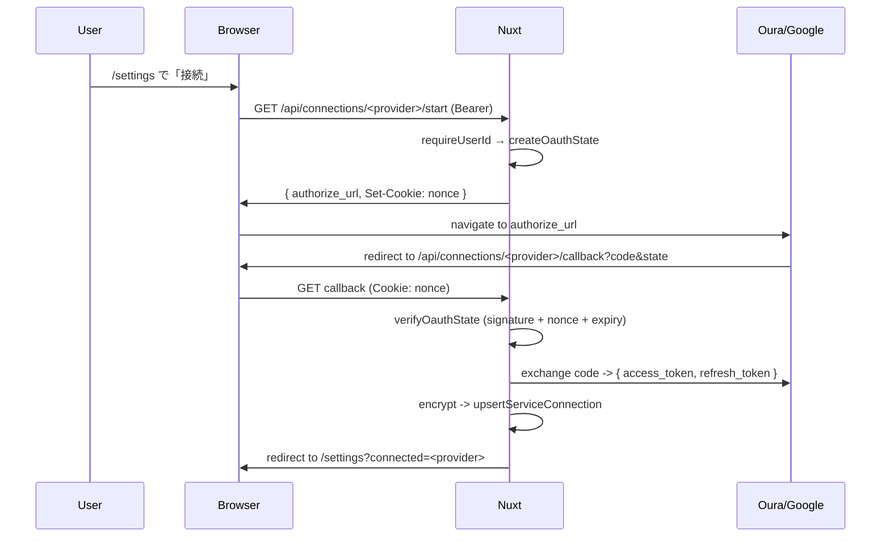

# API

このアプリの API は **Nuxt server routes** で実装されている。  
すべてのエンドポイントは「**認証 → Zod 検証 → 内部関数の編成 → Zod 検証 → 返却**」のパターンに従う。

> 個別のサービス HTTP エンドポイント（`/api/oura` 等）は **公開しない**。外部 API クライアントは `server/utils/` に内部化する（SPEC §9.1 注釈）。

---

## エンドポイント一覧

| メソッド | パス                                                     | 認証                         | 役割                                                                                                                             |
| -------- | -------------------------------------------------------- | ---------------------------- | -------------------------------------------------------------------------------------------------------------------------------- |
| `GET`    | `/api/summary?date=YYYY-MM-DD`                           | Bearer **or cookie**         | 対象日の Today's ME と Wake-based Timeline 用統合データを返す（DB のみ読む）。SSR 経由で叩くため cookie 認証も許容（Issue #141） |
| `POST`   | `/api/summary/refresh`                                   | Bearer **or cookie**         | 対象日のデータを再取得 → 外部 API → DB upsert。SSR 起点の追従 fetch を許すため cookie 認証も許容（Issue #141）                   |
| `GET`    | `/api/cron/daily`                                        | `Bearer ${CRON_SECRET}`      | Vercel Cron 専用。users × 直近 14 日を refresh                                                                                   |
| `GET`    | `/api/connections`                                       | Bearer                       | 現在の連携状況（**トークン本体は返さない**）。Google は最初の 1 行に集約（複数アカウント一覧は `accounts` を参照）               |
| `GET`    | `/api/connections/oura/start`                            | Bearer                       | Oura OAuth 認可開始                                                                                                              |
| `GET`    | `/api/connections/oura/callback`                         | cookie nonce + signed state  | Oura OAuth 認可完了（token を暗号化保存）                                                                                        |
| `GET`    | `/api/connections/google/start[?intent=add]`             | Bearer                       | Google OAuth 認可開始。`intent=add` でアカウントピッカー (`prompt=consent select_account`) を強制                                |
| `GET`    | `/api/connections/google/callback`                       | cookie nonce + signed state  | Google OAuth 認可完了。`id_token` を JWKS 検証して `sub`（`provider_user_id`）と `email`（`account_email`）を backfill           |
| `GET`    | `/api/connections/google/accounts`                       | Bearer                       | 接続済み Google アカウント（= `service_connections` の Google 行）を 0..N 件返す（Issue #131 Phase 3）                           |
| `GET`    | `/api/connections/google/calendars?connection_id=<uuid>` | Bearer                       | 指定 Google 接続のカレンダー一覧 + 接続単位の除外設定                                                                            |
| `PUT`    | `/api/connections/google/excluded-calendars`             | Bearer                       | 接続単位で除外する calendarId 配列を保存（body に `connection_id` + `excluded_calendar_ids`）                                    |
| `POST`   | `/api/connections/toggl`                                 | Bearer                       | Toggl API token を暗号化保存                                                                                                     |
| `DELETE` | `/api/connections/:provider`                             | Bearer                       | Oura / Toggl の連携解除（status を disconnected に）                                                                             |
| `DELETE` | `/api/connections/google/:connectionId`                  | Bearer                       | Google の **接続 ID 単位** ソフト切断（Issue #131 Phase 6）                                                                      |
| `DELETE` | `/api/connections/google/:connectionId/account`          | Bearer                       | Google の **接続 ID 単位** ハード削除。events / 除外設定も cascade で消える（Issue #139）                                        |
| `GET`    | `/api/internal/connections-required`                     | **cookie**（read-only 例外） | `/daily/*` に必要な接続のうち未接続のものを返す                                                                                  |
| `GET`    | `/api/demo/summary?date=YYYY-MM-DD`                      | なし                         | デモ用 summary（`demo_*` テーブルから読む）                                                                                      |
| `POST`   | `/api/free-time-notes`                                   | Bearer                       | 終了済みの空き時間にメモを1件作成                                                                                                |
| `PUT`    | `/api/free-time-notes/:id`                               | Bearer                       | 本人の空き時間メモ本文を更新                                                                                                     |
| `DELETE` | `/api/free-time-notes/:id`                               | Bearer                       | 本人の空き時間メモを削除                                                                                                         |

---

## 共通パターン

### 認証

```ts
const userId = await requireUserId(event);
// or, for SSR-friendly routes:
const userId = await requireUserIdAllowCookie(event);
```

- 基本は `Authorization: Bearer <jwt>` を `server/utils/auth.ts:requireUserId` で検証。失敗時は 401（h3 が JSON 化）。
- **cookie 認証フォールバックを許す例外**（`requireUserIdAllowCookie`）:
  - `/api/internal/connections-required`（`require-connections` middleware 専用 / read-only / 旧来の例外）。
  - `/api/summary` / `/api/summary/refresh`（Issue #141: `daily/[date]` を `useAsyncData` で SSR 化したため。Bearer があれば優先し、無ければ cookie session にフォールバックする）。
- これら以外の mutation ルート（OAuth start / connections の POST・DELETE 等）は **必ず Bearer のみ**。理由は [auth.md](./auth.md) を参照。

### 入力検証

```ts
const params = parseOrThrow(<requestSchema>, getQuery(event));
// or
const body = parseOrThrow(<requestSchema>, await readBody(event));
```

- `server/utils/validation.ts:parseOrThrow` が `safeParse` → 失敗時 `SchemaValidationError`（400）を投げる。
- 直接 `.parse()` を呼ばない。理由は h3 / Nuxt と互換のエラー形式を一元化するため。
- 詳細は **クライアントに返さない**（`path` と `message` のみ）。

### 外部 API レスポンス検証

```ts
const data = parseExternal(<responseSchema>, json, "google");
```

- 失敗時 `502` + `statusMessage: InvalidExternalResponse:<service>`。
- 「外部が壊れた / 仕様変更した」を 502 で明示する。

### レスポンス検証

返す前に **再度 Zod でかける**:

```ts
return parseOrThrow(<responseSchema>, response);
```

- 「サーバ自身がスキーマ違反のレスポンスを返さない」保証。
- 開発中の凡ミス（フィールド名 typo 等）を本番に出さない。

---

## 主要エンドポイント詳細

### `GET /api/summary?date=YYYY-MM-DD`

**責務**: 対象日の Today's ME と Wake-based Timeline 用統合データを返す。

**重要**:

- **DB しか読まない**。外部 API は叩かない（その責務は `refresh` が持つ）。
- `users.timezone` をもとに wake range を計算し、各サービスのレコードは `target_date` 完全一致ではなく `start_at`/`end_at` の重なりで読む。
- サービス未連携時は `todays_me.<service>` を `null` にする。
- 除外カレンダー（`users.excluded_google_calendar_ids`）は Timeline には出すが集計から外す（Issue #108）。
- 対象日の `free_time_notes` を開始時刻順で返す。DB migration未適用時の既存画面停止を避けるため、テーブル未作成エラーに限り空配列と`free_time_notes_available: false`へフォールバックし、UIの編集導線も隠す。

### `/api/free-time-notes`

**責務**: 終了済みの空き時間に対する実績メモを作成・更新・削除する。

- mutationのためBearer認証のみを許可する。
- 作成時は`gap_start_at < gap_end_at`かつ`gap_end_at <= now`を検証する。
- 本文はtrim後1〜1,000文字。ユーザーIDは認証情報から確定し、bodyから受け取らない。
- 更新・削除は`id`と`user_id`の両方で絞り、他ユーザーの行は404として扱う。

**Today's ME の集計ルール**:

- **Oura sleep_minutes / wake_at**: 起床日 = `target_date` となる sleep を選ぶ。複数あれば sleep_minutes が最長のもの（tie-break: wake_at が遅い方）。
- **Google total / by_calendar**: wake range と重なる時間を ms で足し上げ、最後に分へ丸める（累積 drift 回避）。除外カレンダー（`google_excluded_calendars` テーブル, 接続単位）は集計から外す。複数 Google アカウント連携で同名カレンダーが衝突した場合、衝突したラベルだけ `"<name> (<email>)"` に接尾辞を付ける（Issue #131 Phase 7）。**`meeting_minutes` は廃止された**（Issue #151: カレンダー名で会議を機械的に分類するのが本番運用に合わなかったため）。
- **Toggl total / by_title**: 同じく ms で足し上げ。集計キーは `(title, project_name)` の組（Issue #112: 同名タイトルでも別プロジェクトに紐付くものは別バケット）。各エントリに `project_name` を持たせる（未割当 / 未解決は `null`）。

**前段クエリの並列化（Issue #143）**: `users.timezone` / `google_excluded_calendars` / `listServiceConnections` / `daily_sync_statuses` の 4 つは userId / date だけに依存して相互独立なので `Promise.all` で並列に叩く。`wakeRangeOf` は timezone を必要とするため Promise.all の後に直列実行する。

### `POST /api/summary/refresh`

**責務**: `refreshUserDate(userId, date)` の薄いラッパ。

実体は `server/utils/runRefresh.ts`。

- `tryAcquireSyncLock` でサービス単位の排他。
- `withFreshAccessToken` でトークン取得 + 401 retry。
- `sync<Provider>ForDate` で upsert + ソフトデリート。Google は **接続単位** で `listConnectedGoogleConnections` をループし、各 `connection_id` に対して個別に sync する（Issue #131 Phase 4）。
- `markSyncSuccess` / `markSyncFailed` でステータス更新。

**3 provider を並列実行**（Issue #140）: `Promise.allSettled` で Oura / Google / Toggl を同時に走らせる。各 provider の中で例外を捕まえて `outcome` に詰めて正常 resolve するので、`allSettled` の `rejected` は「想定外バグ」のみ。

**部分失敗を許容**: Oura が失敗しても Google / Toggl は走る。`errors` 配列にサービス名と短いメッセージを乗せる。

### `GET /api/cron/daily`

**責務**: Vercel Cron 専用エンドポイント。

- `Authorization: Bearer ${CRON_SECRET}` を `authorizeCron(event)` で検証。`CRON_SECRET` 未設定なら 503（誰でも叩ける状態を防ぐ）。
- `users` 全件 × **直近 14 日** を `refreshUserDate` で回す。
- user 単位の `timezone` / `connected` は 1 回だけ取って 14 日ぶん使い回す。
- `error_count` を集計して返す（**個別エラー詳細はレスポンスに含めない** / ログ流出回避）。

### `GET /api/connections`

**責務**: 連携状況一覧を返す。

**返さないもの**:

- `access_token` / `refresh_token`（暗号化前後問わず）。
- `iv` / `authTag` / `ciphertext`。

返すのは `has_token: boolean`、`status`、`connected_at`、`token_expires_at`。スキーマは `connectionSummarySchema`。

### `POST /api/connections/toggl`

**責務**: Toggl の API token を受け取って暗号化保存。

- Toggl は OAuth ではないので、ユーザーが Toggl Profile 画面で発行した token を直接送信する（HTTPS 前提）。
- バリデーション: 8〜256 文字（`togglConnectRequestSchema`）。
- 暗号化して `service_connections` に upsert。Toggl は refresh の概念が無いので `refreshToken: null` で保存。

### `DELETE /api/connections/:provider`

**責務**: Oura / Toggl の連携解除（ソフト切断）。

- `status` を `disconnected` に更新し、暗号化トークンを `null` に。
- 物理削除はしない（過去の `connected_at` 等のメタ情報を保持）。
- **Google には使わない**。Google は複数アカウント連携を許容するため `connection_id` 単位の `DELETE /api/connections/google/:connectionId` を使う（Issue #131 Phase 6）。

### `DELETE /api/connections/google/:connectionId`

**責務**: Google の **接続 ID 単位** ソフト切断（Issue #131 Phase 6）。

- 対象行が当該 user の Google 行でなければ 404。
- `status='disconnected'` + 暗号化トークン null + 関連 `google_calendar_events` を `is_deleted=true` にソフトデリート。
- `google_excluded_calendars` の行は **残す**（再認可で同じ `provider_user_id` に紐づき直ったときに設定を引き継ぐため）。

### `DELETE /api/connections/google/:connectionId/account`

**責務**: Google の **接続行を物理削除**（Issue #139）。設定画面の一覧からも消す。

- `service_connections` の該当行を `DELETE`。`google_calendar_events` / `google_excluded_calendars` は FK の `ON DELETE CASCADE` で巻き取られる。
- 通常運用ではまず `DELETE /api/connections/google/:connectionId` で soft disconnect してから本エンドポイントを叩く。

### `GET /api/connections/google/accounts`

**責務**: 接続済み Google アカウント（= `service_connections` の Google 行）を 0..N 件返す（Issue #131 Phase 3）。

- `connection_id` / `provider_user_id` / `account_email` / `status` / `has_token` / `connected_at` / `token_expires_at` を返す。
- `/settings` の Google セクションはこのレスポンスを参照して「複数アカウントカード」を描画する。「別のアカウントを追加」ボタンは `GET /api/connections/google/start?intent=add` を叩く。

### `GET /api/connections/google/calendars?connection_id=<uuid>`

**責務**: 指定 Google 接続のカレンダー一覧 + 接続単位の除外設定を返す（Issue #131 Phase 5）。

- `connection_id` で接続を絞ってから Google `calendarList.list` を叩く。
- 除外設定は `google_excluded_calendars` テーブル（`(connection_id, calendar_id)`）から引いて `excluded` フラグを付与する。

### `PUT /api/connections/google/excluded-calendars`

**責務**: 接続単位で、除外する `calendar_id` 配列を「置換」保存する（Issue #131 Phase 5）。

- body: `{ connection_id, excluded_calendar_ids: string[] }`。
- `google_excluded_calendars` の (connection_id) スコープを丸ごと差し替える（delete + insert）。

### `GET /api/internal/connections-required`

**責務**: `require-connections` middleware 専用の read-only エンドポイント。

- cookie 認証（**この 1 つだけ** Bearer 認証の例外）。
- `/daily/*` に必要な接続（Oura + Google）のうち未接続のものを `missing: ["oura", "google"]` で返す。
- 接続済みなら `missing: []`。

---

## OAuth2 フロー（共通）



**state の中身**: `{ uid, nonce, exp }` を HMAC-SHA256 で署名（`server/utils/oauthState.ts`）。

- `uid` は callback で「誰の接続か」を引き当てるために必要（Bearer がリダイレクトでは届かない）。
- `nonce` は cookie と突き合わせて CSRF を防ぐ。

---

## エラーレスポンス形式

部分失敗時（`refresh` / `cron`）:

```json
{
  "target_date": "2026-05-22",
  "sync_statuses": [
    { "source": "oura", "status": "success", ... },
    { "source": "google", "status": "failed", "error_message": "..." }
  ],
  "errors": [
    { "service": "google", "message": "token expired" }
  ]
}
```

完全失敗時（認証 / 検証エラー）: h3 標準の JSON エラーレスポンス（`statusCode` / `statusMessage` / `data`）。

---

## BFF 的責務はあるか

ある。`/api/summary` がまさに BFF。

- 1 リクエストで Today's ME + Timeline + sync_statuses をまとめて返す。
- 各データソース（Oura / Google / Toggl / sync 状態）を **DB レベルで合体** することで、画面は 1 回の fetch で完結する。

これによって:

- 画面側のロジックがシンプル（state 管理が `summary ref` 1 つで済む）。
- ネットワーク往復が減る。
- 認証 / Zod 検証 / RLS の責務がサーバに集約される。

---

## 変更時の注意点

- **新エンドポイントを追加する時の checklist**:
  - [ ] `definePageMeta` ではなく `defineEventHandler` を使う（server route）。
  - [ ] `requireUserId(event)` を最初に呼ぶ（mutation は必須）。
  - [ ] リクエストを `parseOrThrow` で検証。
  - [ ] レスポンスを `parseOrThrow` で検証してから return。
  - [ ] 外部 API レスポンスは `parseExternal` で検証。
  - [ ] スキーマと推論型を `shared/schemas/<対象>.ts` に追加し、`shared/schemas/index.ts` から再 export。
  - [ ] **平文トークンを返さない / ログに出さない**。
  - [ ] テストファイルは明示指示が無い限り作らない（Issue #63）。動作確認は Playwright MCP。

---

## 次に読むもの

- [data-flow.md](./data-flow.md) — リクエストの流れ
- [external-services.md](./external-services.md) — 外部 API クライアントの責務
- [auth.md](./auth.md) — 認証の詳細
