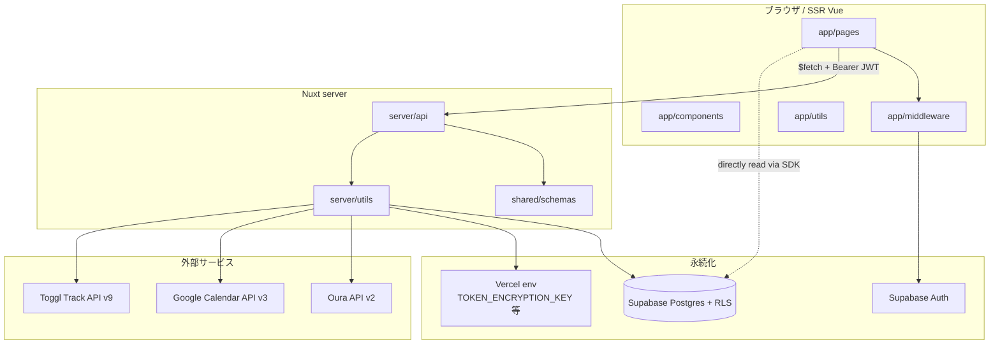

# Architecture Overview

このアプリは「画面」「サーバ API」「同期ユーティリティ」「DB」「外部サービス」の **責務分割** で構成されている。  
ここでは技術スタックの説明ではなく、**「誰が何を担うのか」「なぜ境界がそこなのか」** を説明する。

---

## 全体図



---

## フロントエンド責務

### 役割

- ユーザーに描画する。
- 認証セッションを Supabase SDK 経由で保持し、API リクエストの Bearer ヘッダを組み立てる。
- 「`/daily/today` を開く → サマリーを描画する → stale なら背後で refresh を投げる」のような **UX の編成** を担う。
- **外部 API は直接叩かない**（トークンが必要なため）。

### 関連ディレクトリ

- `app/app.vue`
- `app/layouts/`
- `app/pages/`
- `app/components/`
- `app/middleware/`
- `app/utils/`
- `app/assets/styles/`

### 主なファイル

- `app/pages/daily/[date].vue` … 認証ページのメイン。サマリー取得 + manual refresh + background refresh。
- `app/pages/daily/today.vue` … 「自分にとっての今日」を解決するラッパ（`fetchWakeBasedToday`）。
- `app/pages/demo/daily/[date].vue` … 認証不要のデモページ。`demo_*` テーブルから読む。
- `app/components/DailySummaryView.vue` … 描画用コンポーネント（認証 / デモで再利用）。
- `app/middleware/auth.ts` … `definePageMeta({ middleware: ["auth"] })` で要ログインを宣言する経路。
- `app/middleware/require-connections.ts` … `/daily/*` 用。Oura + Google が必須。未接続なら `/settings` へリダイレクト。
- `app/utils/wakeBasedToday.ts` … 「`today` を起床基準で解決する」クライアントヘルパ。

### データフロー（要点だけ）

```
useSupabaseUser (SDK)
  ↓ session.access_token
$fetch("/api/summary", { Authorization: Bearer ... })
  ↓
描画
```

### 変更時の注意点

- ページが認証必須なら **必ず** `definePageMeta({ middleware: ["auth"] })` を書く。`/daily/*` はさらに `"require-connections"` も並べる。
- 外部サービスのトークンに **絶対に** 触らない（暗号化されているし、復号は server 側責務）。
- 描画用のロジック / 状態はページ or コンポーネントローカルに置く。Pinia ストアは現状無い（後述）。

---

## API 層責務

### 役割

- HTTP の境界。
- リクエストを **Zod で検証** → 認証 → DB / 外部 API への編成 → レスポンスを **Zod で検証** → 返す、までを担う。
- 個別の外部サービス HTTP エンドポイント（`/api/oura` 等）は **公開しない**。API クライアントは `server/utils/` に内部化することで責務とテスト容易性を優先（SPEC §9.1 注釈）。

### 関連ディレクトリ

- `server/api/`
  - `server/api/summary.get.ts`
  - `server/api/summary/refresh.post.ts`
  - `server/api/cron/daily.get.ts`
  - `server/api/connections/...`
  - `server/api/demo/summary.get.ts`
  - `server/api/internal/connections-required.get.ts`

### 主なファイル

- `server/api/summary.get.ts` … `/api/summary?date=...` 。**DB だけを読み**、Today's ME と Timeline を組み立てる。
- `server/api/summary/refresh.post.ts` … `refreshUserDate()` を呼ぶ薄い窓口。
- `server/api/cron/daily.get.ts` … Vercel Cron 専用。`Authorization: Bearer ${CRON_SECRET}` で守る。users × 直近 14 日 を回す。
- `server/api/connections/<provider>/start.get.ts` / `callback.get.ts` … OAuth2（Oura / Google）の認可開始と callback。
- `server/api/connections/toggl.post.ts` … Toggl は OAuth ではなく API token を受け取って暗号化保存。
- `server/api/connections/[provider].delete.ts` … 連携解除（status: disconnected）。
- `server/api/internal/connections-required.get.ts` … `require-connections` middleware 専用。cookie 認証で SSR / client 両方から呼べる read-only。

### データフロー（read 系の典型）

```
リクエスト到着
  ↓
auth.ts:requireUserId(event)   // Bearer JWT 検証
  ↓
parseOrThrow(<request schema>, query/body)
  ↓
DB read or external API call (via server/utils/)
  ↓
parseOrThrow(<response schema>, payload)
  ↓
返却
```

### 変更時の注意点

- **直接 `.parse()` を呼ばない**。`server/utils/validation.ts` の `parseOrThrow` / `parseExternal` を使う。
  - `parseOrThrow` は 400 を投げる（内部入力）。
  - `parseExternal` は 502 を投げる（外部 API レスポンス検証用 / サービス名を載せる）。
- Bearer JWT → `requireUserId` で 401 を投げる。cookie 認証フォールバックは **使わない**（OAuth start のような mutation ルートで CSRF になるため）。例外は `/api/internal/connections-required`（読み取り専用 / 連携状況判定だけ）。
- mutation ルートでは `nonce` cookie + 署名済み state（`server/utils/oauthState.ts`）で CSRF を防ぐ。
- 外部 API レスポンスは **必ず** Zod で検証してから DB へ。
- レスポンスに **平文トークンを含めない**。`connectionSummarySchema.has_token: boolean` のように真偽だけ返す。

---

## 認証責務

### 役割

- ユーザーがログインしている / していないを判定する。
- ログイン済みユーザーの `user_id` を `auth.uid()` として DB に届ける。
- `/daily/*` のような認証必須ページへの未ログインアクセスをブロック / リダイレクトする。

### 関連ディレクトリ

- `app/middleware/auth.ts` … route middleware
- `app/middleware/require-connections.ts` … route middleware（補助）
- `server/utils/auth.ts` … server 側 Bearer 検証
- `server/utils/oauthState.ts` … 外部 OAuth の state 署名（CSRF 対策）
- Supabase Auth 設定（Supabase GUI 側）

### 主なファイル

- `app/middleware/auth.ts` … 認証必須ページに `definePageMeta({ middleware: ["auth"] })` で適用。未ログインなら `/login` へリダイレクト。
- `app/middleware/require-connections.ts` … `/daily/*` 用補助。Oura + Google 未接続なら `/settings?require_connections=<csv>` へ。
- `server/utils/auth.ts:requireUserId(event)` … Server API での Bearer JWT 検証。失敗時 401。
- `server/utils/oauthState.ts` … OAuth2 の state を HMAC-SHA256 で署名 / nonce を cookie と突き合わせる。

### データフロー

```
ログイン (Google or Email)
  ↓
Supabase Auth が JWT を発行
  ↓
@nuxtjs/supabase が cookie に session を保存
  ↓
ページ表示時:
  - クライアント: useSupabaseUser() で参照
  - SSR: middleware が useSupabaseUser() で判定
  ↓
API 呼び出し時:
  session.access_token を Authorization: Bearer ... で送る
  ↓
server/utils/auth.ts:requireUserId(event) が getUser(jwt) で検証
  ↓
DB クエリ時:
  auth.uid() == user_id の RLS ポリシーで行制限
```

### 変更時の注意点

- **Bearer ヘッダ認証を基本にする**（CSRF 対策）。cookie 認証フォールバックは read-only 例外（`/api/internal/connections-required`）以外では絶対に追加しない。理由: OAuth start のような mutation を cookie で通すと、`<a target=_top>` や `` から第三者がトリガーして nonce cookie を上書きでき、OAuth フローを DoS できる。
- 「未ログインなら早期 return」を **middleware で書かない**（auth middleware の責務）。`require-connections` も auth の後に並べる。

---

## DB 責務

### 役割

- ユーザー紐づきデータの永続化。
- **RLS で行レベルアクセス制御**（`auth.uid() = user_id`）。
- 同期ロック（`daily_sync_statuses`）の楽観的排他。
- 外部サービストークン（暗号化済み）の保管。

### 関連ディレクトリ

- `supabase/migrations/` … SQL の source of truth
- `server/utils/supabaseAdmin.ts` … RLS bypass 用 admin client
- 各 `server/utils/sync<Provider>.ts` … テーブルへの upsert / ソフトデリート

### 主なテーブル

| テーブル                    | 責務                                                                                                                                                                                                      |
| --------------------------- | --------------------------------------------------------------------------------------------------------------------------------------------------------------------------------------------------------- |
| `public.users`              | アプリ固有のユーザープロファイル。`auth.users` と 1:1（INSERT トリガで自動生成）。`timezone` を持つ（旧 `excluded_google_calendar_ids` は Phase 5 で `google_excluded_calendars` 表へ移行、列は廃止予定） |
| `service_connections`       | 外部サービストークンと連携状態。`access_token` / `refresh_token` は AES-256-GCM 暗号化保存。Google は `(user_id, provider, provider_user_id)` の partial unique で複数アカウント連携を許容（Issue #131）  |
| `daily_sync_statuses`       | (user_id, target_date, source) 単位の同期状態。`unique` を使って同期ロックを実装                                                                                                                          |
| `oura_sleep_records`        | Oura 睡眠データ。`target_date = wake_at の日付` (Issue #24)                                                                                                                                               |
| `google_calendar_events`    | Google Calendar 予定。`connection_id` を持ち (user_id, connection_id, calendar_id, google_event_id) で unique（Issue #131 Phase 4）                                                                       |
| `google_excluded_calendars` | Google カレンダー除外設定（接続単位 / Issue #131 Phase 5）                                                                                                                                                |
| `toggl_time_entries`        | Toggl Track 作業ログ。`project_id` / `project_name` を含む（Issue #112）                                                                                                                                  |
| `demo_*` テーブル群         | 公開デモ用。本番テーブルと完全分離                                                                                                                                                                        |

詳細は [database.md](./database.md) を参照。

### 変更時の注意点

- マイグレーションは Supabase GUI で変更後、SQL を `supabase/migrations/` にコミットする（Issue #26）。
- 新しい user 紐づきテーブルを作る時は **必ず RLS を有効化** し、`auth.uid() = user_id` の 4 ポリシー（select / insert / update / delete）を貼る。
- 削除は `is_deleted = true`。Read 側は必ず `eq("is_deleted", false)` で絞る。

---

## 同期 / 外部サービス責務

### 役割

- Oura / Google / Toggl から最新データを取得して DB に upsert する。
- OAuth2 のトークンライフサイクル（authorize / callback / refresh）。
- 同期の **多重実行抑止**（`daily_sync_statuses` を使った楽観ロック）。
- **部分失敗を許容**: 1 サービスが落ちても他は続行。

### 関連ディレクトリ

- `server/utils/oauth/` … OAuth2 認可 / トークン交換
- `server/utils/get<Provider>Data.ts` … 外部 API から取得して検証して整形
- `server/utils/sync<Provider>.ts` … 取得結果を DB に upsert + ソフトデリート
- `server/utils/runRefresh.ts` … 1 user × 1 日付 の編成
- `server/utils/syncLock.ts` … `daily_sync_statuses` を使ったロック
- `server/utils/serviceConnection.ts` … トークン保存 / 復号 / refresh

### 主なファイル

- `server/utils/runRefresh.ts:refreshUserDate(userId, date)` … この関数が「1 user × 1 日付 の編成」の唯一の入り口。`/api/summary/refresh` も `/api/cron/daily` もここを呼ぶ。
- `server/utils/syncLock.ts:tryAcquireSyncLock()` / `markSyncSuccess()` / `markSyncFailed()` … 同期の排他とステータス更新。
- `server/utils/serviceConnection.ts:withFreshAccessToken()` … 401 を受けたら 1 回だけ refresh して再試行する高階関数。同期は **必ず** これを介す。
- `server/utils/serviceConnection.ts:getValidAccessToken()` … トークン取得 + 期限が近ければ事前 refresh。
- `server/utils/crypto.ts` … AES-256-GCM の encrypt / decrypt。
- `server/utils/oauthState.ts` … OAuth state の HMAC 署名 / nonce 検証。

### データフロー

```
POST /api/summary/refresh または GET /api/cron/daily
  ↓
runRefresh.ts:refreshUserDate(userId, date)
  ↓
Promise.allSettled([oura, google, toggl])  // Issue #140 で 3 provider を並列実行
  ├─ oura / toggl: 単一接続行で sync
  └─ google: listConnectedGoogleConnections() を回し connection_id 単位で sync
  各 provider 内:
  - tryAcquireSyncLock()
  - withFreshAccessToken(...) {
      get<Provider>Data(...)  // 外部 API を叩いて Zod で検証
    }
  - sync<Provider>ForDate()   // upsert + ソフトデリート
  - markSyncSuccess() or markSyncFailed()
```

### 変更時の注意点

- 同期は **サービス単位で try/catch** する。1 サービスの失敗が他を巻き込まない設計（SPEC §9.2）。
- `withFreshAccessToken` を **必ず** 介してトークンを取り出す。直接 `service_connections` を引いて復号するコードを増やさない。
- `markSyncSuccess` / `markSyncFailed` は **lockId（= 奪取時の sync_started_at）** を WHERE 条件に渡す。これを忘れると、stale 奪取で別 worker に lock を取られた後に古い worker が status を上書きしてしまう。
- 外部 API レスポンスは `parseExternal()` で検証して 502 にする。

---

## 状態管理責務

### 役割

- 「セッション」「フェッチ済みサマリー」「フォーム入力」を保持する。
- ただし **現状 Pinia ストアは無い**。

### 設計判断

| 種類                       | どこに置くか                                                                |
| -------------------------- | --------------------------------------------------------------------------- |
| **認証セッション**         | Supabase SDK の内部状態 + cookie（`useSupabaseUser` / `useSupabaseClient`） |
| **サマリーデータ**         | ページコンポーネントの `ref`（`/daily/[date].vue`）                         |
| **フォーム入力**           | ページの `ref`                                                              |
| **API 取得後のキャッシュ** | 現状なし。同じページを開き直すと再フェッチする                              |

### なぜ Pinia が無いのか

- SPEC §8 には記載があるが、**現状ストアを必要とする状態が無い**。
- 過去に `@pinia/nuxt` を入れた状態で本番が全ルート 500 になる事故があった（Issue #99 / Pinia v3.0.4 の SSR バンドル問題）。
- **`defineStore` を実際に使い始める時に再導入し、本番でも一度検証する** が現在の方針（`nuxt.config.ts` のコメント参照）。

詳細は [state-management.md](./state-management.md) を参照。

---

## キャッシュ / 同期トリガー責務

### 役割

- 「いつ外部 API を叩くか」のポリシー。

### ルール（SPEC §10.2）

| トリガー                 | 対象         | タイミング                                                  |
| ------------------------ | ------------ | ----------------------------------------------------------- |
| 手動更新ボタン           | 表示中の日   | `/daily/[date]` でクリック                                  |
| バックグラウンド自動更新 | **当日のみ** | `last_synced_at` が 30 分以上古ければ表示直後に背後で投げる |
| Vercel Cron              | 直近 14 日   | 毎朝 05:00 JST（`vercel.json`）                             |

15 日以前は **自動同期しない**。手動更新のみ。

### 変更時の注意点

- 「過去日も裏で勝手に refresh する」のは仕様違反。古いデータが意図せず書き換わる。
- 30 分の閾値は `app/pages/daily/[date].vue` の `STALE_MS` 定数。

---

## デプロイ責務

### 役割

- Preview / Production への配備。
- Cron の起動。
- エラー報告。

### 関連

- **Vercel** … Nuxt のホスティング。`main` ブランチは保護。PR ごとに Preview が立つ。
- **Vercel Cron** … `vercel.json` で `0 20 * * *` UTC（= 05:00 JST）に `GET /api/cron/daily` を起動。`Authorization: Bearer ${CRON_SECRET}` で Vercel が自動付与。
- **Sentry** … `@sentry/nuxt` で client / server 両方に初期化済み（`sentry.client.config.ts` / `sentry.server.config.ts`）。
- **GitHub Actions** … `.github/workflows/ci-check.yml` で `pnpm lint` / `nuxi typecheck` / `pnpm build` を回す。

詳細は [deployment.md](./deployment.md) を参照。

---

## なぜこの分割なのか（要点）

| 境界                                       | 理由                                                                                                                                                                                                                  |
| ------------------------------------------ | --------------------------------------------------------------------------------------------------------------------------------------------------------------------------------------------------------------------- |
| **画面 / サーバ**                          | 外部 API トークンを画面に出さないため。Bearer 認証 + Server API で「機密に触る責務」をサーバに閉じ込める                                                                                                              |
| **`server/api` / `server/utils`**          | HTTP の境界と「DB / 外部 API の編成」を分離。HTTP に依存しないユーティリティは再利用しやすく、テストもしやすい（実際 cron と `/api/summary/refresh` で `refreshUserDate` を共有している）                             |
| **個別サービスエンドポイントを公開しない** | `/api/oura` のような窓口を増やすと認証 / レート / 暗号化 / 検証の責務が散らかる。`get<Provider>Data` を内部関数化することで、外側からは `summary` / `refresh` の 2 つの責務だけ見えるようにしている（SPEC §9.1 注釈） |
| **`shared/schemas` を画面とサーバで共有**  | 「クライアント側で型を再宣言」「サーバ側だけ Zod で検証」のズレを防ぐ。Zod スキーマと推論型を必ずペアで named export することで、型と検証の source of truth を 1 つにする                                             |
| **デモテーブルを本番と分離**               | 公開デモは「ログイン不要・外部 API 不要」の前提。本番テーブルに混ぜると RLS / トークンの責務が崩れる                                                                                                                  |
| **タイムゾーンを `users` に持つ**          | 「Wake-based Timeline の起点をどう決めるか」が user 属性。フロントで Date を弄ると `Intl.DateTimeFormat` の ICU データ差で挙動が変わるため、サーバが userTimezone を持って整形する責務を負う                          |

---

## 次に読むもの

- [data-flow.md](./data-flow.md) — 実際のリクエストが流れる順序
- [auth.md](./auth.md) — 認証の完全理解
- [database.md](./database.md) — テーブルと RLS の詳細
