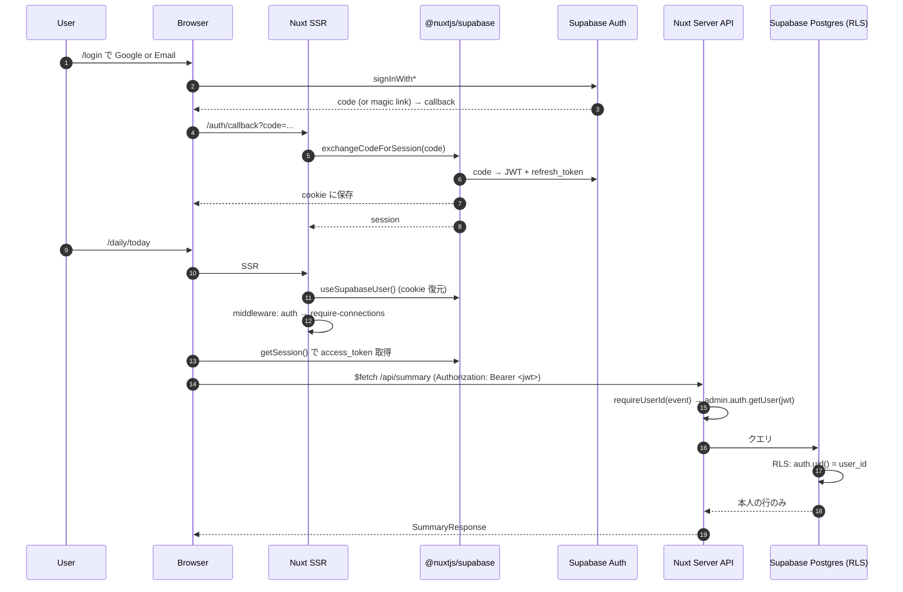

# Auth

このアプリの認証 / 認可は **Supabase Auth + Supabase RLS + 自前の Bearer 検証 + OAuth state 署名** の組み合わせ。  
ここでは「**なぜ middleware と RLS と Bearer の三段構えなのか**」を順に解いていく。

---

## 全体像



---

## 認証の役割分担

| 役割 | 担当 |
| --- | --- |
| **JWT の発行** | Supabase Auth |
| **ブラウザでの session 保持** | `@nuxtjs/supabase` (cookie) |
| **画面側のルートガード** | `app/middleware/auth.ts` |
| **必須連携のガード** | `app/middleware/require-connections.ts` |
| **サーバ API での認証** | `server/utils/auth.ts:requireUserId(event)` |
| **DB レベルの認可** | RLS（`auth.uid() = user_id`）|
| **OAuth2 の state 防御** | `server/utils/oauthState.ts` |

---

## なぜ middleware が必要なのか

未ログインユーザーが `/daily/today` を直接開いた時、SSR が DB を叩く前に弾きたい。
- RLS だけだと「行が返ってこないだけ」になり、ユーザーには「空のページ」が見えてしまう。
- middleware で先に `/login` へリダイレクトすることで、UX としても破綻しない。

加えて `require-connections` は「Oura / Google が繋がってないと使い物にならないページ」（`/daily/*`）への到達を止める。Wake-based Timeline は Oura の起床時刻が無いと成立しないため（SPEC §4.2）、未接続のままページを開かせない。

```ts
// 認証必須ページの宣言（app/pages/daily/[date].vue 等）
definePageMeta({ middleware: ["auth", "require-connections"] });
```

`auth` → `require-connections` の順で並べる。`require-connections` 自身も「未ログインなら何もしない」で抜けて、`auth` に判断を任せる。

---

## なぜ RLS が必要なのか

middleware や `requireUserId` は **アプリ層の認可**。穴があると他人のデータが見えるリスクが残る。

RLS は **DB 自身が「自分のもの以外は見せない」を保証** する最後の砦。
- 全 user 紐づきテーブルで RLS を有効化。
- 4 つのポリシー（select / insert / update / delete）に `auth.uid() = user_id` を貼る。
- `service_connections` だけは `force row level security` で **policy を一切貼っていない**。これは authenticated client から **絶対に直接読ませない** ため。サーバが `getSupabaseAdmin()` で bypass する以外に読み出し経路が無い。

```sql
-- 例: oura_sleep_records
alter table public.oura_sleep_records enable row level security;
create policy "oura_sleep_records_select_own"
  on public.oura_sleep_records
  for select
  to authenticated
  using (auth.uid() = user_id);
```

---

## なぜ client / server を分けているのか

| キー | 用途 | どこで使うか |
| --- | --- | --- |
| `NUXT_PUBLIC_SUPABASE_PUBLISHABLE_KEY` | 旧 anon key 相当。RLS が効く | **ブラウザ** と SSR の両方 |
| `SUPABASE_SECRET_KEY` | 旧 service_role 相当。**RLS を bypass する** | **server only**。`getSupabaseAdmin()` 経由 |

- ブラウザに secret を渡したら **任意ユーザーの行が読み放題** になるため絶対に出さない。
- server 側でも、admin client は `service_connections` の暗号化トークンを読む等 RLS では到達できない処理のためにだけ使う。

---

## Bearer 認証と CSRF 対策

API 認証は **Authorization: Bearer ヘッダ** を基本とする（`server/utils/auth.ts:requireUserId`）。

```ts
const token = extractBearerToken(event);
if (!token) throw createError({ statusCode: 401 });
const { data, error } = await admin.auth.getUser(token);
if (error || !data.user) throw createError({ statusCode: 401 });
return data.user.id;
```

**なぜ cookie 認証フォールバックを付けないのか**:
- OAuth start のような **mutation を伴うルート** を cookie 認証で通すと、`<a target=_top>`・``・リダイレクト等の第三者からのトップレベルナビゲーションでも認証が通ってしまう。
- 結果、nonce cookie を上書きされて OAuth フロー DoS に至る（CSRF）。
- Bearer ヘッダはクロスオリジンナビゲーションでは送られないため CSRF にならない。

**cookie 認証フォールバックを許す例外**（`requireUserIdAllowCookie`）:
- `/api/internal/connections-required`（`require-connections` middleware 専用 / read-only）。SDK が cookie から session を内部状態に復元するタイミングが route middleware より遅いことがあり、Bearer ヘッダではガードが擦り抜ける問題があったため（Issue #104）。
- `/api/summary` / `/api/summary/refresh`（Issue #141: `daily/[date]` を `useAsyncData` で SSR 化したため、初回 fetch では Bearer が間に合わない）。Bearer があれば優先し、無ければ cookie session にフォールバックする。

これらは「nonce 等の認証 cookie を書き換えない」「第三者のトップレベル navigation から呼ばれても害が無い」範囲に限定している。OAuth start のような mutation ルートには絶対に cookie フォールバックを追加しない。

---

## OAuth2 の state 署名（外部サービス連携）

Oura / Google を繋ぐ時の `state` パラメータは「**HMAC-SHA256 で署名 + nonce を cookie と突き合わせ + 10 分で expire**」の三段構え。

```ts
// server/utils/oauthState.ts
state = base64UrlEncode({ uid, nonce, exp }) + "." + HMAC_SHA256(secret, payload)
```

- **uid** … 認可ユーザーが誰か（callback でこの uid を使って `upsertServiceConnection`）。
- **nonce** … ランダム 16 bytes。`/start` で cookie にも保存し、`/callback` で `timingSafeEqual` で照合（CSRF 対策）。
- **exp** … Unix 秒。10 分で expire。
- 署名鍵は `OAUTH_STATE_SECRET`。未設定なら `TOKEN_ENCRYPTION_KEY` から `todaysme:oauth-state:v1` ラベルで派生（鍵分離）。

`callback` 側:
1. cookie の nonce を読む。無ければ 400。
2. `verifyOauthState(state, nonce)` … 署名 + nonce + expiry を検証。
3. `exchange<Provider>Code(code)` で token を取得。
4. Google のみ: token レスポンスの `id_token` を `verifyGoogleIdToken`（`jose` の `createRemoteJWKSet` でキャッシュ付き JWKS 検証）で検証し、`sub`（= `provider_user_id`）と `email`（= `account_email`）を取り出す（Issue #131 Phase 2）。
5. `upsertServiceConnection({ accessToken, refreshToken, providerUserId?, accountEmail?, ... })` で暗号化保存。Google は `(user_id, provider, provider_user_id)` の partial unique で衝突判定するので、同じ `sub` を持つ既存行があれば UPDATE（= 再認可）、無ければ INSERT（= 別アカウントの追加）になる。

---

## OAuth token のライフサイクル

| イベント | 何が起きるか |
| --- | --- |
| 初回認可 | `access_token` / `refresh_token` を AES-256-GCM で暗号化して `service_connections` に保存。Google は `id_token` を JWKS 検証して `provider_user_id` / `account_email` も埋める |
| 同期処理 | Oura / Toggl は `withFreshAccessToken(userId, provider, fn)` を介して取得。Google は `listConnectedGoogleConnections(userId)` で接続行を列挙し、`connection_id` 単位でトークンを取り出してループ実行（Issue #131 Phase 4）|
| 期限近傍 | `getValidAccessToken` が事前 refresh（5 分以内に切れる場合）|
| 401 を受けた | `withFreshAccessToken` が強制 refresh + 1 回だけ retry |
| refresh 失敗 | `service_connections.status = error` に楽観ロックで遷移 / `OauthRefreshError` を throw |
| `provider_user_id` 未取得の旧 Google 行 | `status = needs_reauth` に落として sync から外す。settings バナーで再認可を促す（Issue #131 Phase 2）|
| ソフト切断 | Oura / Toggl: `DELETE /api/connections/:provider` で `status = disconnected` + トークン null。Google: `DELETE /api/connections/google/:connectionId` で接続 ID 単位に同じ処理（events も soft-delete）|
| ハード削除 | Google のみ: `DELETE /api/connections/google/:connectionId/account` で接続行を物理削除。events / 除外設定は FK の `ON DELETE CASCADE` で巻き取られる（Issue #139）|

`refresh_token` の保持仕様は 3 状態:
- `undefined` → 既存 DB 値を保持（Google の通常 refresh / 一部の再認可レスポンス）。
- `null` → 明示的に null に（Toggl の API token 解除等）。
- `string` → 新しい値で上書き。

これは「Google が refresh レスポンスで `refresh_token` を返さない」ケースで誤って null に上書きしてオフラインアクセスを失わないため。

---

## ログインフロー詳細

### Google OAuth（Supabase Auth）

```
/login で「Google でログイン」クリック
  ↓
supabase.auth.signInWithOAuth({ provider: "google", options: { redirectTo: "/auth/callback" } })
  ↓
Google 認可
  ↓
/auth/callback?code=...
  ↓
supabase.auth.exchangeCodeForSession(code)
  ↓
session が cookie に保存され /daily/today へ navigate
```

- このフローの `redirectTo` の検証は `app/pages/auth/callback.vue` の `resolveNext()` が担う。`/` 始まりの安全な path のみ許容（オープンリダイレクト防御）。

### Email + Password

`@nuxtjs/supabase` の `signInWithPassword` 経由。callback ページは同じ `/auth/callback` を通る（magic link / OTP も同じハンドラ）。

### サインアップ

`/signup` で同様。`auth.users` に行が増えると、`public.handle_new_user()` トリガが `public.users` にも行を作る（`supabase/migrations/20260517160000_create_users_table.sql`）。

---

## Route guard と権限

このアプリには **ロール / 権限の概念が無い**（MVP は単一ユーザー）。

代わりに「**接続済みサービス**」が事実上の権限になる:
- `/daily/*` … Oura + Google が必須（`require-connections`）。
- `/settings` … 認証だけ必須。
- `/demo/*` / `/` … 認証不要。

将来マルチユーザー化する時にロールが必要になっても、middleware 層に追加できるよう「auth と require-connections を順序付きで並べる」パターンを維持しておくと拡張しやすい。

---

## よくある質問

### Q. なぜ `auth` を全体 middleware（`app/middleware/<name>.global.ts`）にしないのか
A. デモ・ログイン・サインアップは認証不要なため。**ページ単位で `definePageMeta({ middleware: ["auth"] })` を明示** することで「認証が必要なページか」が宣言から読める。

### Q. SSR でも `useSupabaseUser` は使えるのか
A. `@nuxtjs/supabase` が cookie から session を復元してくれる。ただし API 呼び出しに必要な `access_token` は `getSession()` で取り直す必要があるため、`/daily/[date].vue` は `onMounted` で fetch する（SSR 中の DB アクセスは現状無い）。

### Q. なぜ middleware で `useSupabaseUser` の `value` を見ているのか
A. SDK 提供の reactive ref。SSR 時は cookie から復元済み / client 時はメモリに保持済み。両方で同じコードが動く。

### Q. Token expiry はサーバが見ているのか
A. JWT 自体の expiry は Supabase Auth が `getUser()` 内部で検証する。**外部サービス**（Oura / Google）の access_token expiry は `service_connections.token_expires_at` をサーバが見て、5 分前倒しで refresh する。

---

## 変更時の注意点

- 新しい認証必須ページを追加したら **必ず** `definePageMeta({ middleware: ["auth"] })`。`/daily/*` 系なら `"require-connections"` も並べる。
- 新しい mutation API を追加したら **必ず** `requireUserId(event)` を最初に呼ぶ。
- cookie 認証のフォールバックを追加しない（read-only / connections-required 以外）。
- RLS を新テーブルにも忘れず有効化。`select / insert / update / delete` 4 ポリシー。
- トークンや secret を **ログに出さない / レスポンスに乗せない / クライアントに渡さない**。

---

## 次に読むもの

- [database.md](./database.md) — RLS の実装詳細
- [external-services.md](./external-services.md) — OAuth クライアントの実装
- [api.md](./api.md) — エンドポイントごとの認証要件
