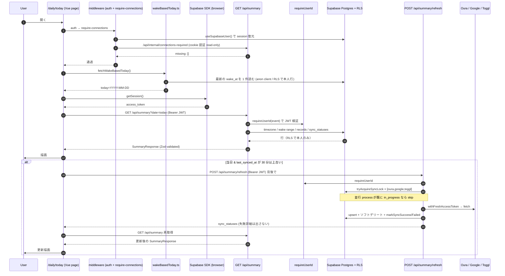
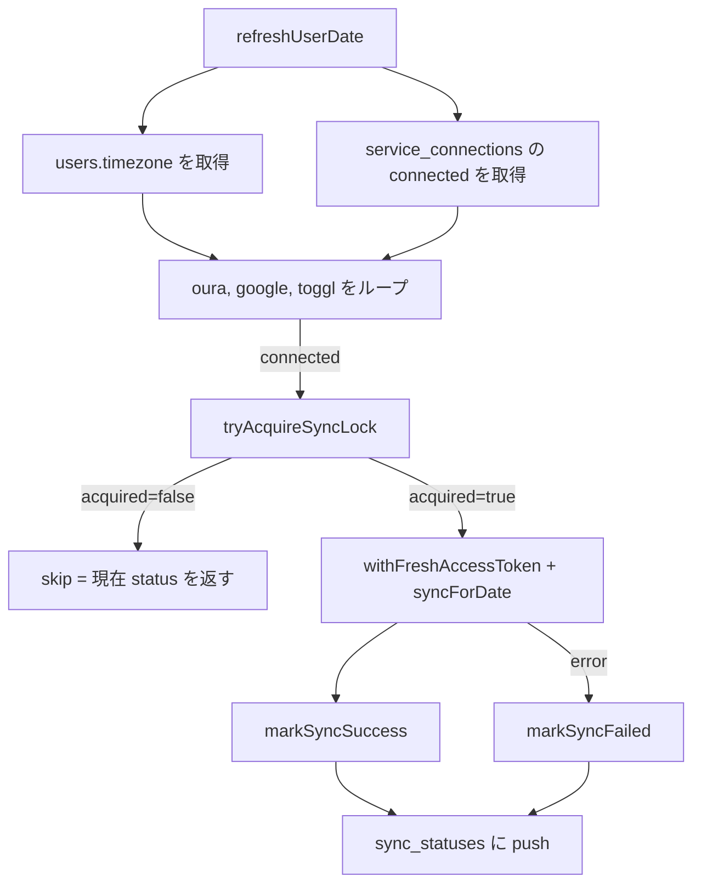

# Data Flow

「ユーザー操作 → DB → 画面更新」までを **責務をまたぐ流れ** として説明する。  
個々の関数の仕様ではなく、「**誰が誰を呼ぶか / どこで何が検証 / 暗号化 / 認可されるか**」に焦点を当てる。

---

## 全体像（`/daily/today` を開いた時）



---

## フロー詳細

### 1. ページ初期化と認証

`/daily/[date].vue` は `definePageMeta({ middleware: ["auth", "require-connections"] })` を宣言している。

- **`auth` middleware** … `useSupabaseUser()` で SDK が cookie から復元した user を見る。未ログインなら `/login` へ。
- **`require-connections` middleware** … `/api/internal/connections-required`（**cookie 認証 read-only**）で Oura / Google が繋がっているか確認。未接続なら `/settings?require_connections=...` へ。

**なぜ cookie 認証なのか**: `require-connections` は **route middleware** で動く。Supabase SDK が cookie から session を内部状態に復元するタイミングが route middleware より遅いことがあり、token 未取得時に early-return するとガードが擦り抜けていた（過去事例 / Issue #104）。`require-connections` の参照する `/api/internal/connections-required` だけは cookie 認証 + read-only の例外として許容している。それ以外の API は **必ず** Bearer 認証（CSRF 対策）。

### 2. `today` の解決

`/daily/today.vue` は「**Wake-based today**」を `fetchWakeBasedToday()` で計算する。最新の `oura_sleep_records.wake_at` の日付を「今日」とみなす。
- 起床していない深夜 → まだ「昨日」扱い。
- Oura 未連携 → カレンダー日付に fallback（実際には require-connections で `/settings` に飛ばされるので、ここまで来ない）。

### 3. サマリー取得

ページが mount したら `$fetch("/api/summary", { headers: bearerHeaders() })` を呼ぶ。

サーバ側（`server/api/summary.get.ts`）:

1. `requireUserId(event)` … `Authorization: Bearer <jwt>` を Supabase Admin で検証 → `user_id` を得る。失敗 401。
2. `parseOrThrow(summaryRequestSchema, query)` … `date` を Zod で検証。失敗 400。
3. `users` から `timezone` / `excluded_google_calendar_ids` を読む。なければ 500（黙って Asia/Tokyo に fallback しない）。
4. `wakeRangeOf(date, userId)` … 起床範囲を組み立てる（前後 ±2 日の sleep を読む）。
5. `listServiceConnections(userId)` … 連携済みプロバイダを判定。
6. wake range と重なる `oura_sleep_records` / `google_calendar_events` / `toggl_time_entries` を **並列で** 読む。
7. `daily_sync_statuses` を読む。
8. Today's ME と Timeline を組み立てる（**外部 API は叩かない**）。
9. `parseOrThrow(summaryResponseSchema, response)` で返す前にも Zod 検証。

**ポイント**: `target_date` 完全一致では取りこぼすので、各サービスの read は `start_at / end_at` を wake range と重ねる。Sleep だけ「main sleep が wake_at == range.start で常に成立する」ため、判定基準を strict ではなく inclusive にしている。

### 4. Stale 判定とバックグラウンド更新

```ts
const STALE_MS = 30 * 60 * 1000;
function isStale(s: SummaryResponse): boolean {
  if (!isTodayInTimezone(s.target_date, s.timezone)) return false;
  if (s.sync_statuses.length === 0) return true;
  const t = Date.now();
  return s.sync_statuses.some(st => {
    if (!st.last_synced_at) return true;
    return t - new Date(st.last_synced_at).getTime() > STALE_MS;
  });
}
```

- **当日のみ** stale 判定を行う（過去日は手動更新だけ）。
- いずれかの sync が 30 分以上古ければ `POST /api/summary/refresh` を背後で投げる。
- 失敗してもユーザー操作を妨げない（エラーは UI に出さない）。
- レースを避けるため `activeRequestId` をインクリメントして、最新リクエスト以外のレスポンスは破棄。

### 5. Refresh の編成

`/api/summary/refresh` は `runRefresh.ts:refreshUserDate(userId, date)` を呼ぶだけの薄いラッパ。



#### 各 sync の中身（Google を例に）

1. `withFreshAccessToken("google", async (token) => { ... })`
   - 内部で `getValidAccessToken()` を呼ぶ。token_expires_at が 5 分以内に切れる場合は事前 refresh。
   - 401 を受けたら強制 refresh + 1 回だけ retry。
2. `getGoogleData({ token, timeMin, timeMax, ... })`
   - `events.list` を pagination + 必要に応じて `nextSyncToken` 差分同期で叩く。
   - 410 Gone が返ったら syncToken を破棄して timeMin/timeMax で全件再取得。
   - レスポンスを **`parseExternal()` で Zod 検証**（失敗 502 / `InvalidExternalResponse:google`）。
3. `google_calendar_events` に upsert（`onConflict: user_id,calendar_id,google_event_id`）。
4. 「今回の結果に含まれない既存行」を **calendar_id ごとに** ソフトデリート。
5. 「今回 calendarList に登場しないカレンダー」由来の既存行も対象日ぶんソフトデリート（購読解除されたケース）。

### 6. トークンライフサイクル

```mermaid
flowchart LR
  start[Settings UI で接続] --> startApi[GET /api/connections/google/start]
  startApi --> state[createOauthState: HMAC sign + nonce cookie]
  state --> redir[Google authorize URL を返す]
  User --> Google[Google 認可画面]
  Google --> cb[GET /api/connections/google/callback]
  cb --> verify[verifyOauthState: 署名 + nonce + expiry]
  verify --> token[exchangeGoogleCode]
  token --> enc[encrypt access/refresh + upsertServiceConnection]

  Sync[同期処理] --> getToken[withFreshAccessToken]
  getToken --> read[loadConnectionForToken]
  read --> dec[decrypt access_token]
  dec --> call[外部 API を叩く]
  call -->|401| refresh[performRefresh]
  refresh --> upsert[upsertServiceConnection]
  upsert --> retry[再試行]
```

- **平文トークンは「メモリ内に短時間のみ」**。
- レスポンス、ログには絶対に出さない。
- `refresh_token` を新しく受け取らなかった場合は `undefined` で渡すと既存値を保持する（Google は通常 refresh では返さない）。
- 並走する refresh の片方が成功・片方が失敗するケースで healthy な接続を `error` に巻き戻さないよう、`markConnectionError` は **`updated_at` の楽観ロック** を使う。

### 7. 同期ロック

`daily_sync_statuses` の `unique(user_id, target_date, source)` 行を **条件付き UPDATE** して `status = in_progress` に切り替えることで多重実行を抑止する（楽観排他）。

奪取の条件:
- 行が無ければ事前に `idle` で INSERT。
- `status != in_progress` または `sync_started_at` が **10 分** より古い場合に奪える（stale lock 回収）。

奪取時に書き込んだ `sync_started_at`（= `lockId`）を `markSyncSuccess` / `markSyncFailed` の WHERE 条件に渡す。**これを忘れると、stale 奪取で別 worker に lock を取られた後に古い worker が status を上書きしてしまう**。

### 8. Cron 経路

`vercel.json` で `0 20 * * *` UTC（= 05:00 JST）に `GET /api/cron/daily` を起動。

```ts
authorizeCron(event)   // Bearer ${CRON_SECRET} のみ許可
↓
users 全件 × 直近 14 日 をループ
↓
各 (user, date) で refreshUserDate(userId, date, { timezone, connected })
```

- timezone / connected は user 単位で 1 回だけ取って 14 日ぶん使い回す（DB 負荷削減）。
- 1 user の bad timezone でバッチ全体が止まらないよう `resolveTimezone()` で `Asia/Tokyo` に sanitize。
- `error_count` だけ集計して返す。**個別エラー詳細はレスポンスに含めない**（ログ流出回避）。

---

## エラー処理の責務

| エラータイプ | どこで起きて、誰が、どう処理するか |
| --- | --- |
| **Zod 検証失敗（リクエスト）** | API 内 `parseOrThrow` が 400 を投げる。h3 が JSON にする |
| **Zod 検証失敗（外部 API レスポンス）** | `get<Provider>Data` の `parseExternal` が 502 を投げる。`statusMessage: InvalidExternalResponse:<service>` |
| **JWT 不正** | `requireUserId` が 401 を投げる |
| **OAuth refresh 失敗** | `OauthRefreshError`。`service_connections.status = error` に落とす |
| **外部 API 401** | `OauthUnauthorizedError`。`withFreshAccessToken` が 1 回だけ refresh して retry |
| **個別サービスの sync エラー** | `runRefresh` が try/catch で受けて `markSyncFailed` + `errors` に push。他サービスの sync は続行 |
| **DB エラー** | 各 sync が throw → `runRefresh` の try/catch → `markSyncFailed`。markSyncFailed 自体が落ちたら `errors` にだけ残す |
| **クライアントの $fetch 失敗** | ページの `errorMessage` に表示。バックグラウンド refresh の失敗は UI に出さない |
| **想定外の例外** | Sentry が拾う（client / server 両方）|

---

## キャッシュ / 読み出し戦略

- **画面側**: SWR 的なキャッシュは無い。日付遷移で再フェッチ。レースは `activeRequestId` で守る。
- **サーバ側**: read は毎回 DB を引く。`summary` は事前計算しない（取得時に組み立てる / SPEC §9.1）。
- **外部 API**: 直接叩くのは refresh 時のみ。表示時は DB のみ。

---

## なぜ「読み出しは DB のみ」「書き込み（外部 API）は refresh のみ」を分けるのか

- **レスポンスタイム**: `/daily/today` を開くたびに外部 API を叩くと、Oura のレート制限と Google の latency に引きずられる。
- **再現性**: 過去日を開いた時に外部 API の状態が変わると、見るたびに違うデータになってしまう。
- **同期の冪等性**: refresh を「データを取り直してテーブルを最新化する」専任にすることで、UI 側は DB が source of truth と扱えば良い。
- **冗長性**: 外部 API 障害時も DB の最後の同期結果で `/daily/today` は表示できる。

---

## 次に読むもの

- [auth.md](./auth.md) — 認証の完全理解
- [api.md](./api.md) — 各エンドポイントの責務
- [external-services.md](./external-services.md) — Oura / Google / Toggl 連携の詳細
