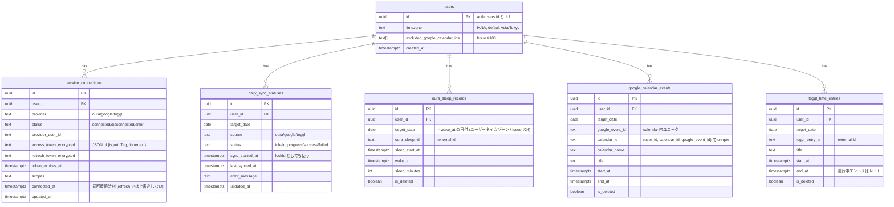

# Database

このアプリのデータは **Supabase PostgreSQL** に格納する。テーブルは大きく 3 系統:

1. **アプリ固有のユーザープロファイル**（`public.users`）
2. **外部サービス連携 + 同期状態**（`service_connections` / `daily_sync_statuses`）
3. **同期されたデータ本体**（`oura_sleep_records` / `google_calendar_events` / `toggl_time_entries`）

加えて、公開デモ用の `demo_*` テーブル群が本番と完全分離して存在する。

> SQL の正は `supabase/migrations/` 配下。Supabase GUI で変更したら **必ず** マイグレーションファイルとしてコミットする（Issue #26）。

---

## ER 図



---

## 各テーブルの責務

### `public.users`

**役割**: Supabase Auth の `auth.users` に対応するアプリ固有のプロファイル。

- `id` は `auth.users.id` と 1:1（`on delete cascade`）。
- `auth.users` への INSERT を `public.handle_new_user()` トリガで捕捉して自動生成（`security definer`）。
- `timezone` … ユーザーの IANA タイムゾーン。`target_date` 算出 / wake range 計算で使う。
- `excluded_google_calendar_ids` … Google calendarId の配列（Issue #108）。「予定ブロック」用カレンダーを稼働時間集計から外す。
- RLS: `select` / `update` を `auth.uid() = id` で自分自身に限定。

**なぜトリガで自動生成するのか**: ユーザーが初めて `/daily/today` を開いた時に「`public.users` 行が無くて 500 エラー」になるのを防ぐ。サインアップ時点で確実に行を作る。

### `service_connections`

**役割**: 外部サービストークン + 連携状態。

- `unique(user_id, provider)` … 同一ユーザーで同一プロバイダは 1 行。
- `access_token_encrypted` / `refresh_token_encrypted` は **AES-256-GCM** で暗号化した JSON 文字列（`{iv, authTag, ciphertext}`）。
- `connected_at` は **初回接続時刻** を保持。refresh のたびに上書きしてはいけない（`/api/connections` の「いつ繋いだか」表示が常に「今」になるため）。
- `updated_at` は **楽観ロック** にも使う（`markConnectionError` が「読み取り時点から行が動いていない」場合のみ status を error に落とす）。
- RLS は **`force row level security`** で **policy 0 個**。つまり authenticated client からは絶対に読めない。サーバが `getSupabaseAdmin()` で bypass する経路のみが読み出し手段。

**なぜ完全に隠すのか**: トークン暗号化は AES-256-GCM だが、`ciphertext` をブラウザに渡してしまうと「クライアントに鍵があれば復号できる」ことになり責務が崩れる。`has_token: boolean` のような派生情報だけ `/api/connections` 経由で返す。

### `daily_sync_statuses`

**役割**: (user × target_date × source) 単位の同期状態。**同期ロック** にも使う。

- `unique(user_id, target_date, source)` を排他のキーにする。
- `status`: `idle` / `in_progress` / `success` / `failed`。
- `sync_started_at` を **lockId** として使う:
  - `tryAcquireSyncLock` は奪取時に `sync_started_at = now()` を書く。
  - `markSyncSuccess` / `markSyncFailed` は **その値を WHERE 条件に含める** ことで「自分が握っている lock だけ更新」を保証。
- stale lock 回収: `sync_started_at` が **10 分** より古い `in_progress` は次の `tryAcquireSyncLock` で奪える。
- RLS: 4 ポリシー（`auth.uid() = user_id`）。

**なぜタイムスタンプではなく `unique` 制約 + 条件付き UPDATE なのか**: Postgres にロウレベルロックを直接張る代わりに、`unique` 制約 + 楽観ロック（`status != 'in_progress' OR sync_started_at < cutoff`）で「行を 1 件に絞り込み、原子的に状態遷移する」シンプルな構造にした。Vercel Functions のような短命プロセスから扱いやすい。

### `oura_sleep_records`

**役割**: Oura の睡眠記録。

- `unique(user_id, oura_sleep_id)` で external id を主キーとする upsert。
- `target_date` は **「ユーザータイムゾーンでの `wake_at` の日付」**（SPEC §2 / Issue #24）。睡眠開始日ではない。
- index: `(user_id, target_date)` と `(user_id, sleep_start_at, wake_at)` 両方。タイムライン取得時は range 検索を使う。
- RLS: 4 ポリシー。

**なぜ起床日に紐づけるのか**: ユーザーの体感としての「その日」は起床から始まる。深夜 0 時跨ぎで睡眠開始日と起床日が違う場合、起床日を target_date にすれば「自分の今日」と一致する。

### `google_calendar_events`

**役割**: Google Calendar のイベント。

- `unique(user_id, calendar_id, google_event_id)` … **calendar_id を含める** 理由は、Google `event.id` がカレンダー内ユニークでしかないため。複数カレンダーから同期するとカレンダー跨ぎで衝突するため。
- `target_date` … ユーザータイムゾーンでのイベント日。タイムライン取得は wake range overlap で読む。
- `calendar_name` … `summaryOverride > summary` で決まる Google の表示名。
- index: `(user_id, target_date)` と `(user_id, start_at, end_at)`。
- RLS: 4 ポリシー。

### `toggl_time_entries`

**役割**: Toggl Track の time entry。

- `unique(user_id, toggl_entry_id)`。
- `end_at` は **NULL を許容**（進行中エントリ）。read 側は `end_at IS NULL OR end_at >= fromIso` の or 条件で絞る。
- RLS: 4 ポリシー。

### `demo_*` テーブル群

**役割**: 公開デモ用データ。本番テーブルと完全分離。

- 認証不要 / 外部 API 不要。
- 公開 read 可能な RLS を設定。
- 本番テーブルに混ぜない理由: RLS / トークン / 同期状態の責務が崩れるため。

---

## RLS の実装パターン

全 user 紐づきテーブル（`service_connections` 除く）で同じパターン:

```sql
alter table public.<table> enable row level security;

create policy "<table>_select_own"
  on public.<table>
  for select
  to authenticated
  using (auth.uid() = user_id);

create policy "<table>_insert_own"
  on public.<table>
  for insert
  to authenticated
  with check (auth.uid() = user_id);

create policy "<table>_update_own"
  on public.<table>
  for update
  to authenticated
  using (auth.uid() = user_id)
  with check (auth.uid() = user_id);

create policy "<table>_delete_own"
  on public.<table>
  for delete
  to authenticated
  using (auth.uid() = user_id);
```

`service_connections` だけは:

```sql
alter table public.service_connections enable row level security;
alter table public.service_connections force row level security;
-- policy は貼らない
```

→ admin client（`SUPABASE_SECRET_KEY`）からしか読めない。

---

## ソフトデリート

```sql
update <table> set is_deleted = true where ...;
```

- 物理削除しない（SPEC §11.3）。
- 同期時に「外部側で消えたレコード」を `is_deleted = true` にする。
- read 側は **必ず** `eq("is_deleted", false)` で絞る。

理由:
- 外部 API 一時障害で「取れなかった = 削除された」と誤判定するのを防ぐ（厳密にはこちらは差分同期 + ソフトデリートで対応している）。
- 過去日の表示が空に化けるのを防ぐ。
- 必要なら admin が手動で復元できる。

---

## マイグレーション運用

1. **Supabase GUI で変更**（ローカル `supabase/` でも本番でも）。
2. 変更後の SQL を `supabase/migrations/<timestamp>_<description>.sql` としてコミット。
3. ファイル冒頭に **「何のための変更か」「背景となる Issue / SPEC §」** をコメントで書く（既存ファイルがこのスタイルなので合わせる）。
4. 既存のマイグレーションを編集しない（履歴を巻き戻すことになるため、新しいタイムスタンプの追加マイグレーションで対応）。

---

## なぜ `target_date` を持つのか

read 側は `start_at` / `end_at` の overlap で wake range と照合する設計だが、**`target_date` も持つ理由**:

1. **インデックスの効率**: `(user_id, target_date)` で素早く対象日付近のレコードを引ける。
2. **ソフトデリート時のスコープ絞り込み**: 「対象日に紐づく既存レコードのうち今回取得結果に含まれないもの」をソフトデリートする際に必要。
3. **Today's ME の oura 集計**: 「起床日 = `target_date` となる sleep」を選ぶ（SPEC §4.1）。

---

## 容量設計の考え方

MVP は単一ユーザー前提のため、大容量は想定していない:
- 14 日 × 1 ユーザー × 各サービス数十レコード程度。
- index は (user_id, target_date) と (user_id, start_at, end_at) の 2 種類。
- 将来マルチユーザー化する時は partition / archive を検討する。

---

## 変更時の注意点

- **新テーブルを追加する時の checklist**:
  - [ ] `user_id uuid not null references public.users (id) on delete cascade`
  - [ ] `is_deleted boolean not null default false`（同期データなら）
  - [ ] `created_at` / `updated_at` の `timestamptz default now()`
  - [ ] external id の `unique` 制約（同期データなら）
  - [ ] `(user_id, target_date)` index
  - [ ] **RLS を `enable`**
  - [ ] **select / insert / update / delete の 4 ポリシー**（`auth.uid() = user_id`）
  - [ ] マイグレーションファイル冒頭に責務コメント

- 既存テーブルにカラムを追加する時は、必ず新しいタイムスタンプのマイグレーションファイルで `alter table` を書く。

---

## 次に読むもの

- [auth.md](./auth.md) — RLS と認証の繋がり
- [external-services.md](./external-services.md) — どのデータをどう upsert するか
- [data-flow.md](./data-flow.md) — 読み取り / 書き込みのタイミング
