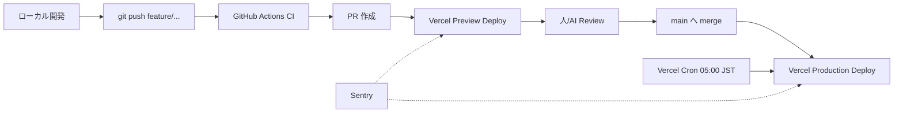

# Deployment

このアプリは **Vercel** にデプロイされている。Nuxt 4 のホスティング、Cron、Preview デプロイ、エラートラッキング、CI を組み合わせている。

---

## デプロイ構成



---

## Vercel

### Production / Preview

- `main` ブランチ → **Production**。
- すべての PR → **Preview Deploy**（一意の URL）。
- `main` は **保護ブランチ**。直接 push 不可。
- PR は Vercel Preview で動作確認してからマージ（SPEC §13）。

### 環境変数

Vercel Project Settings → Environment Variables で管理。プロダクション / プレビュー / ローカルで個別に設定可能。詳細は [environment.md](./environment.md) を参照。

### Build と Output

- パッケージマネージャ: **pnpm 11**（corepack）。
- Node: **22**（`.nvmrc`）。
- ビルドコマンド: `pnpm build`（Nuxt 4 / Vite 8）。
- Output: Vercel が Nuxt 4 を auto-detect。

### `vercel.json`

```json
{
  "$schema": "https://openapi.vercel.sh/vercel.json",
  "crons": [{ "path": "/api/cron/daily", "schedule": "0 20 * * *" }]
}
```

- スケジュールは **UTC**。`0 20 * * *` UTC = **05:00 JST**。
- Vercel Cron は `Authorization: Bearer ${CRON_SECRET}` を自動付与する。
- 受け側（`server/api/cron/daily.get.ts`）が `authorizeCron(event)` で検証 → 一致しなければ 401 / 503。

---

## Cron の責務

毎朝 05:00 JST に `GET /api/cron/daily` が呼ばれる:

- `users` 全件 × **直近 14 日**（today を含む）を `refreshUserDate` で順次回す。
- user 単位の `timezone` / `connected` は 1 回だけ読んで 14 日ぶん使い回す。
- 1 user の bad timezone でバッチが止まらないよう `resolveTimezone()` で fallback。
- 1 サービスの失敗が他に波及しないよう try/catch（SPEC §9.2）。
- 失敗詳細はレスポンスに含めず、`error_count` だけ返す（ログ流出回避）。

**15 日以前は自動同期しない**（SPEC §10.3）。手動更新ボタンを押した時のみ取得する。

### Vercel Function の制限

- ハードリミット: 15 分前後（プラン依存）。
- それを超える sync は事故扱い。`STALE_LOCK_MINUTES = 10` の stale lock 回収はこの想定に基づく。
- マルチユーザー化する時はバッチを分割するか、別の cron スケジュールに切る。

---

## CI（GitHub Actions）

`.github/workflows/ci-check.yml`:

実行内容（push / PR ごと）:

- `pnpm install --frozen-lockfile`
- `pnpm lint`（ESLint）
- `pnpm nuxi typecheck`
- `pnpm build`

ローカル側でも:

- Husky + lint-staged で `eslint --fix` + `prettier --write` を pre-commit。

---

## Sentry

`@sentry/nuxt` を `nuxt.config.ts` の `modules` と `sentry` セクションで有効化。client / server 両方を初期化。

- `sentry.client.config.ts` … ブラウザ側初期化。
- `sentry.server.config.ts` … サーバ側初期化。
- `nuxt.config.ts`: `sentry.org` / `sentry.project` / `autoInjectServerSentry: "top-level-import"`。
- ソースマップアップロード: `SENTRY_AUTH_TOKEN`（`.env.sentry-build-plugin` に置く / Vercel env でも設定）。

---

## Cloudflare

- Proxy は利用しない（SPEC §7.3）。
- DNS 管理だけ Cloudflare を使う可能性あり。

---

## デプロイの流れ（実務）

1. **ローカルで実装**:

   ```bash
   git checkout main
   git pull origin main
   git checkout -b feature/issue-<番号>-<短い説明>
   # 実装
   pnpm typecheck
   pnpm lint
   pnpm sass        # UI 実装後（worktree 並行作業中は除く）
   # Playwright MCP で UI 動作確認
   git commit ...
   git push -u origin feature/...
   ```

2. **PR 作成**:
   - `main` を base にする（staging があれば staging）。
   - `Closes #<番号>` をボディに入れる。
   - `@codex review` をコメントする（CLAUDE.md 必須ルール）。

3. **Vercel Preview で動作確認**:
   - PR ごとに Preview Deploy URL が発行される。
   - 主要フロー（ログイン / `/daily/today` / `/settings`）を踏む。

4. **マージ → Production**:
   - レビュー OK 後マージ。
   - 自動で Vercel Production Deploy。
   - Sentry が新リリースを認識（source map を upload している前提）。

---

## ロールバック戦略

- **Vercel の Promote 機能** を使う: 過去のデプロイを「Promote to Production」で即座に切り戻せる。
- DB マイグレーションを含む変更は backward-compatible で書く（新カラム追加は default 値あり、廃止カラムは別 PR で順次）。
- 暗号化トークン / RLS まわりは段階的に変更する（一度に schema + ポリシー + アプリを全部変えない）。

---

## デプロイ前のチェックリスト

PR を出す前に:

- [ ] `pnpm typecheck` が通る
- [ ] `pnpm lint` が通る
- [ ] `pnpm lint:style` が通る（UI 変更時）
- [ ] `pnpm sass` で SCSS をコンパイル（**ただし worktree 並行作業中はスキップ**）
- [ ] Playwright MCP で UI 動作確認（UI 変更時）
- [ ] 秘密情報が commit に含まれていない（`.env` / `*.pem` / token 文字列等）
- [ ] CLAUDE.md / SPEC.md / オンボーディングの記述と矛盾しない
- [ ] 新エンドポイント / 新テーブルなら RLS / Zod スキーマも更新

---

## Production の URL と OGP

- 本番 URL: 自身の Vercel 設定。
- OGP: `app/app.vue` で `useSeoMeta` を設定。OGP 画像は `public/ogp-rectangle.png` / `public/ogp-square.png`。

---

## 監視 / アラート

- Vercel Dashboard … Build / Function ログ / Cron 実行履歴。
- Sentry … エラー検知 / リリース別の発生率。
- Supabase Dashboard … DB クエリログ / Auth ログ。

---

## 次に読むもの

- [environment.md](./environment.md) — 環境変数の意味
- [api.md](./api.md) — Cron が呼ぶエンドポイントの詳細
